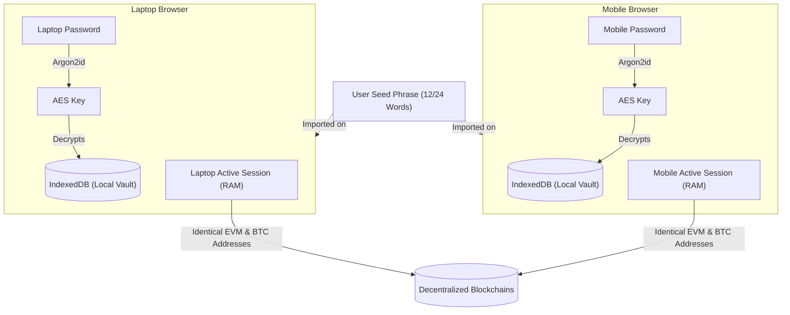
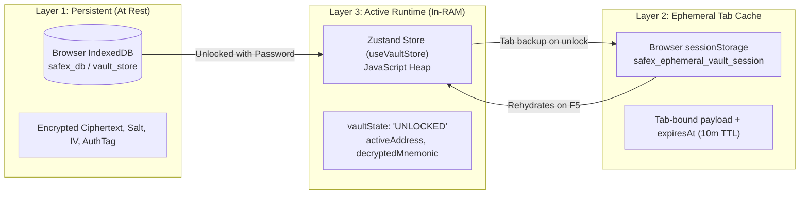
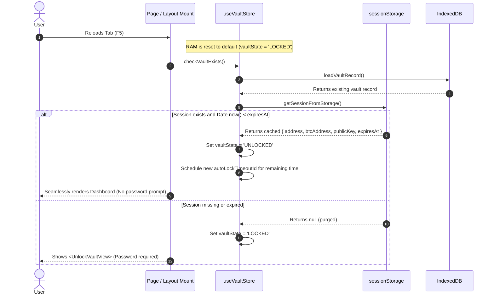
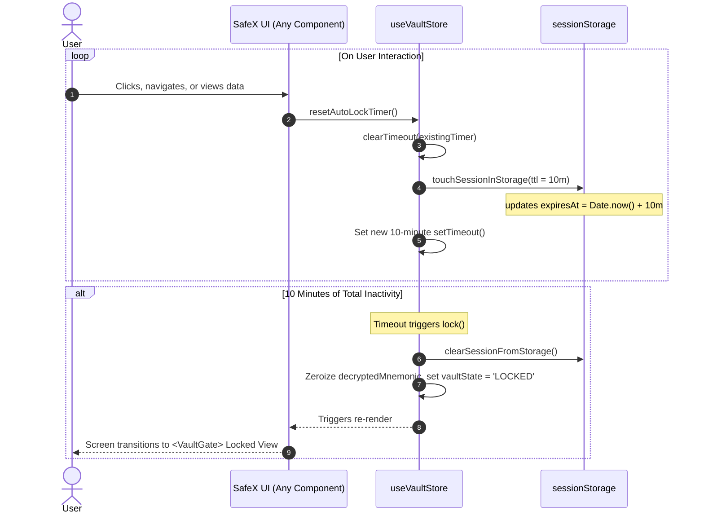
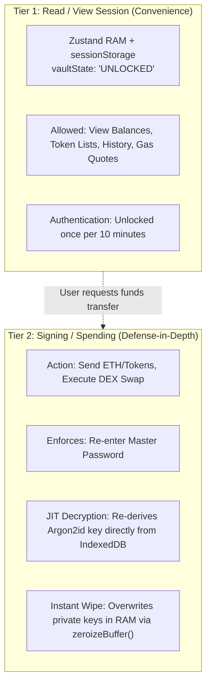

# SafeX Session Architecture & Authorization Fundamentals

This document provides a comprehensive technical breakdown of how user sessions, storage layers, and security authorizations function in the SafeX crypto wallet.

---

## 1. Zero-Trust Non-Custodial Model vs. Web2 Auth

Unlike traditional Web2 web applications (which use centralized databases, email/password tables, and backend session cookies/JWTs), SafeX operates on a **zero-trust, non-custodial** model.

| Dimension | Traditional Web2 Web Apps | SafeX Web3 Wallet |
|---|---|---|
| **Identity Anchor** | Central DB user record (`id`, `email`, `password_hash`) | BIP-39 Mnemonic Seed Phrase (12/24 words) |
| **Authentication Authority** | Backend Auth Server / IdP issuing signed cookies/JWTs | Local browser cryptography (Argon2id + AES-256-GCM) |
| **Session State Location** | Central Redis / SQL DB / server-signed cookies | Local IndexedDB + ephemeral browser RAM & `sessionStorage` |
| **Multi-Device Sync** | Same user logs in against centralized backend API | User imports the identical seed phrase independently on each device |

### Multi-Device Independence (Mobile vs. Laptop)
- A user can import the **same 12/24-word seed phrase** on both their laptop and mobile browser.
- Each device creates its **own independent local encrypted vault** inside its browser's IndexedDB.
- Passwords on each device can be completely different because password decryption is 100% local.
- Unlocking, locking, or closing tabs on the laptop has **zero impact** on the mobile session. Both derive identical blockchain addresses and sign transactions independently.

---

## 2. The Three Storage Layers

SafeX uses a three-tier storage model to balance **security** and **user experience**:

| Layer | Technology | Content | Durability & Scope |
|---|---|---|---|
| **1. At Rest** | **IndexedDB** | AES-256-GCM encrypted ciphertext, 16B salt, 12B IV, 16B auth tag, Argon2 parameters | Permanent on that browser until manually wiped or browser data cleared. |
| **2. Ephemeral Tab** | **`sessionStorage`** | Public session payload (`address`, `btcAddress`, `publicKey`) + `expiresAt` timestamp (10m TTL). **Never stores seed phrase or private keys.** | **Tab-isolated.** Survives `F5` reload within the tab; destroyed the instant the tab is closed. Immune to XSS seed phrase exfiltration. |
| **3. Runtime Memory** | **Zustand (RAM)** | Reactive status (`vaultState: 'UNLOCKED' \| 'LOCKED'`), `activeAddress`, `activeBtcAddress`, `activePublicKey` | Pure JavaScript memory. Cleared whenever the page unloads or F5 is pressed. |

### Why `sessionStorage`?
1. **Survives Reloads (`F5`):** If state were kept *only* in JavaScript memory (Zustand), pressing `F5` or navigating between pages would lock the wallet and require password re-entry on every refresh.
2. **Instant Destruction on Tab Close:** Unlike `localStorage` (which writes unencrypted data to the hard drive indefinitely), `sessionStorage` is automatically wiped by the browser operating system the instant the tab closes.
3. **Tab Isolation:** Opening the app in a second tab cannot read the first tab's `sessionStorage`.

---

## 3. End-to-End Session Lifecycles

### Flow A: Initial Unlock (Entering Passcode)

```mermaid
sequenceDiagram
    autonumber
    actor User
    participant UI as UnlockVaultView / VaultGate
    participant Store as useVaultStore (Zustand)
    participant Crypto as vaultService.unlockVault()
    participant IDB as IndexedDB (vaultStorage)
    participant Tab as sessionStorage

    User->>UI: Submits Master Password
    UI->>Store: unlock(password)
    Store->>Crypto: unlockVault(password)
    Crypto->>IDB: loadVaultRecord()
    IDB-->>Crypto: Returns { salt, iv, authTag, ciphertext, ... }
    
    rect rgb(20, 30, 45)
        Note over Crypto: Argon2id KDF: Derives 256-bit AES key from (password + salt)
        Note over Crypto: AES-256-GCM: Decrypts ciphertext & validates authTag
    end

    alt Decryption Fails (Wrong Password or Tampered)
        Crypto-->>UI: Throws InvalidPasswordError
        UI-->>User: Displays error message
    else Decryption Succeeds
        Crypto-->>Store: Returns { mnemonic, address, btcAddress, publicKey }
        Store->>Tab: saveSessionToStorage({ address, btcAddress, publicKey }, ttl = 10m)
        Note over Tab: Seed phrase is NEVER written to sessionStorage
        Store->>Store: Set autoLockTimeoutId = setTimeout(10m)
        Store->>Store: Set vaultState = 'UNLOCKED', activeAddress, decryptedMnemonic
        Store-->>UI: Vault unlocked
        UI-->>User: Redirects to /dashboard
    end
```

---

### Flow B: Surviving a Page Reload (`F5`)

When the user refreshes their active tab, JavaScript memory is completely cleared. The app rehydrates state from `sessionStorage` without asking for the password again:

---

### Flow C: Auto-Lock and Activity Reset

---

## 4. UI Protection: How the App Stays Logged In

A common misconception is that the app checks `sessionStorage` or inspects the mnemonic before every user click.

### Reality: Reactive In-RAM State
1. **Clicks do not touch storage:** Clicking buttons, switching between tabs, or changing chart views does not read `sessionStorage`.
2. **Components read Zustand memory:** Protected views simply read `const { vaultState } = useVaultStore()`. Since `vaultState === 'UNLOCKED'` in memory, components render instantly.
3. **The Guard Component (`<VaultGate>`):**
   - Protected routes (`/dashboard`, `/send`, `/swap`, `/settings`) wrap their content in [`<VaultGate>`](file:///c:/Users/mrsan/Desktop/SafeX---Crypto-Wallet/apps/web/components/VaultGate.tsx).
   - `VaultGate` is a standard React component evaluated during page render. If `vaultState === 'UNLOCKED'`, it renders the children directly. If `vaultState === 'LOCKED'`, it renders the password input form.

---

## 5. Two-Tier Authorization Model (Read vs. Sign)

SafeX implements a **strict two-tier security boundary** that separates *portfolio viewing* from *signing financial transactions*:

### Why Re-Prompt for Password on Send/Swap?
If the app allowed transactions to sign automatically using the mnemonic sitting in `sessionStorage` or `useVaultStore`:
1. **Malicious Script / Extension Abuse:** If an attacker exploited an XSS vulnerability or a malicious browser extension ran in the background, it could silently call `signAndSend(...)` and drain user funds while the user stepped away from the tab.
2. **Proof of Human Presence:** Requiring the password at the moment of signing ensures that a human being is sitting at the keyboard approving the exact transaction.
3. **Just-In-Time (JIT) Key Disposal:**
   - In [`signEip1559Transaction()`](file:///c:/Users/mrsan/Desktop/SafeX---Crypto-Wallet/apps/web/core/crypto/transactions/transactionSigner.ts#L34), the seed phrase is decrypted into a temporary local variable.
   - The ECDSA transaction signature is generated.
   - [`zeroizeBuffer()`](file:///c:/Users/mrsan/Desktop/SafeX---Crypto-Wallet/apps/web/core/crypto/vault/memory.ts) immediately overwrites the key buffer with `0x00`.
   - The raw private key exists in memory for only a few milliseconds.

---

## 6. Code Reference Map

| Component / Function | File Location | Purpose |
|---|---|---|
| **IndexedDB Storage Engine** | [`vaultStorage.ts`](file:///c:/Users/mrsan/Desktop/SafeX---Crypto-Wallet/apps/web/core/crypto/vault/vaultStorage.ts) | Reads/writes encrypted `VaultRecord` to browser IndexedDB (`safex_db`). |
| **KDF & AES Decryption** | [`vaultService.ts`](file:///c:/Users/mrsan/Desktop/SafeX---Crypto-Wallet/apps/web/core/crypto/vault/vaultService.ts) | Argon2id key derivation and AES-256-GCM decryption routines. |
| **Active Session & Auto-Lock** | [`useVaultStore.ts`](file:///c:/Users/mrsan/Desktop/SafeX---Crypto-Wallet/apps/web/core/store/useVaultStore.ts) | In-memory Zustand store and `sessionStorage` 10-minute cache management. |
| **Route Protection Gate** | [`VaultGate.tsx`](file:///c:/Users/mrsan/Desktop/SafeX---Crypto-Wallet/apps/web/components/VaultGate.tsx) | Conditional React component rendering dashboard or password unlock form. |
| **JIT Transaction Signer** | [`transactionSigner.ts`](file:///c:/Users/mrsan/Desktop/SafeX---Crypto-Wallet/apps/web/core/crypto/transactions/transactionSigner.ts) | Re-prompts password, derives private key, signs transaction, and zeroizes memory. |
| **Memory Sanitization** | [`memory.ts`](file:///c:/Users/mrsan/Desktop/SafeX---Crypto-Wallet/apps/web/core/crypto/vault/memory.ts) | Overwrites private key buffers in RAM with zeros immediately after signing. |
