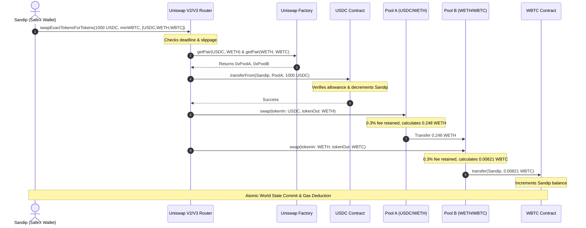

# 🔥 SafeX Blockchain Handbook — USDC → WBTC Swap (Complete EVM Flow)

> **Context**: Complete end-to-end trace of an on-chain token swap on Ethereum.
> From the moment SafeX builds and signs the transaction offline until WBTC appears in your wallet.

---

### Scenario: Swap 1,000 USDC → WBTC on Ethereum
- **User Action**: One user transaction, one ECDSA signature, one gas payment.
- **Under the Hood**: Multiple internal smart contract calls, routing across liquidity pools, and atomic state updates.

---

# 🌍 Complete Architecture Before Anything Happens

All contracts involved in the swap are already permanently deployed on Ethereum:

```text
┌────────────────────────────────────────────────────────────────────────────────────────┐
│                        ALL SMART CONTRACTS PRE-EXIST ON ETHEREUM                       │
├─────────────────────────┬──────────────────────────────────────────────────────────────┤
│ Contract / Entity       │ Role & Responsibility                                        │
├─────────────────────────┼──────────────────────────────────────────────────────────────┤
│ 1. Your Wallet (EOA)    │ Holds your USDC and native ETH for gas. Signs transactions.  │
│ 2. USDC Contract        │ Stores USDC balances mapping & allowances table.             │
│ 3. Uniswap Router       │ User-facing entry point; orchestrates multi-hop swaps.       │
│ 4. Uniswap Factory      │ Registry contract; knows every liquidity pool address.       │
│ 5. USDC / WETH Pool (A) │ Holds USDC and WETH reserves; computes x * y = k.            │
│ 6. WETH / WBTC Pool (B) │ Holds WETH and WBTC reserves; computes x * y = k.            │
│ 7. WBTC Contract        │ Stores WBTC balances mapping & token logic.                  │
└─────────────────────────┴──────────────────────────────────────────────────────────────┘
```

SafeX only ever initiates contact with the **Uniswap Router**. The router coordinates all subsequent interactions.

---

# STEP 1 — SafeX Builds the Transaction

The user inputs the swap parameters in the SafeX UI:

| Field | Input Value |
| :--- | :--- |
| **From** | `1,000 USDC` |
| **To** | `WBTC` |
| **Slippage Tolerance** | `0.5%` |

SafeX constructs one EIP-1559 transaction object:

```typescript
const txRequest = {
  to: UNISWAP_ROUTER_ADDRESS,
  value: 0n, // Zero ETH sent (it's a token swap, not native ETH)
  data: encodeFunctionData({
    abi: uniswapRouterAbi,
    functionName: 'swapExactTokensForTokens',
    args: [
      1000000000n, // amountIn: 1000 USDC (6 decimals: 1000 * 10^6)
      amountOutMin, // Minimum acceptable WBTC after 0.5% slippage
      [USDC_ADDRESS, WETH_ADDRESS, WBTC_ADDRESS], // path: multi-hop route
      userAddress, // recipient: who receives the WBTC
      deadline, // Expiry timestamp (e.g. current block timestamp + 20 mins)
    ]
  }),
  chainId: 1, // Ethereum Mainnet (or 11155111 for Sepolia)
  nonce,
  maxFeePerGas,
  maxPriorityFeePerGas,
}
```

### Breakdown of the Calldata (`data`)

| Parameter | Type | Value / Purpose |
| :--- | :--- | :--- |
| **Function Selector** | `bytes4` | `0x38ed1739` (`swapExactTokensForTokens`) |
| **`amountIn`** | `uint256` | `1000000000` (1,000 USDC in 6 decimal units) |
| **`amountOutMin`** | `uint256` | Minimum WBTC acceptable (protects against sandwich attacks) |
| **`path` ⭐** | `address[]` | `[USDC, WETH, WBTC]` (Direct USDC/WBTC pool lacks depth; routed via WETH) |
| **`recipient`** | `address` | Your SafeX wallet address |
| **`deadline`** | `uint256` | Unix timestamp after which miners must reject the transaction |

---

# STEP 2 — SafeX Signs the Payload Offline (Phase 3 Engine Reused)

The exact zero-trust client signing pipeline already built in SafeX executes:

```text
1. Transaction Object (to, value, data, nonce, gas)
         │
         ▼
2. EIP-1559 RLP Serialization (0x02 || rlp([chainId, nonce, ...]))
         │
         ▼
3. Keccak-256 Hash of serialized payload
         │
         ▼
4. ECDSA Signature in RAM via secp256k1 (produces r, s, yParity)
         │
         ▼
5. Attach Signature to transaction components
         │
         ▼
6. Final RLP Serialization
         │
         ▼
7. Raw Signed Hex Bytes: 0x02f901ae...
```

> **Security Invariant**: The private key is decrypted in RAM via Argon2id + AES-GCM, signs the transaction, and the memory buffer is immediately zeroized. The private key never leaves your device.

---

# STEP 3 — Ethereum Validators Receive the Transaction

Ethereum validator nodes receive the raw signed bytes via the public P2P mempool. They see:

| Field | Value |
| :--- | :--- |
| **`to`** | Uniswap Router Contract Address |
| **`data`** | Encoded swap calldata (`0x38ed1739...`) |
| **`signature`** | `(r, s, yParity)` |

The validator:
1. Recovers your public key and Ethereum address via `ecrecover(hash, r, s, v)`.
2. Verifies your nonce and checks that your EOA has enough native ETH to cover the maximum gas fee.
3. Passes the transaction to the EVM and begins executing the **Uniswap Router's bytecode**.

---

# STEP 4 — Router Decodes the Calldata

The EVM loads the Uniswap Router bytecode into execution context.
The Router reads the calldata:
```solidity
swapExactTokensForTokens(
    amountIn = 1000 * 10^6,
    amountOutMin = 0.00816 * 10^8,
    path = [USDC, WETH, WBTC],
    to = SandipWallet,
    deadline = 1757390000
)
```
The Router verifies:
- `block.timestamp <= deadline` (the transaction has not expired).
- `path.length >= 2` (valid swap path).

---

# STEP 5 — Router Finds Required Liquidity Pools via Factory

Because the swap path is `[USDC, WETH, WBTC]`, the Router must locate two pools:
1. **Pool A**: `USDC ↔ WETH`
2. **Pool B**: `WETH ↔ WBTC`

The Router calls the **Uniswap Factory** contract:
```solidity
address poolA = factory.getPair(USDC, WETH); // Returns 0xPool_A
address poolB = factory.getPair(WETH, WBTC); // Returns 0xPool_B
```

| Token Pair | Resolved Pool Address | Role in Swap |
| :--- | :--- | :--- |
| **USDC ↔ WETH** | `0xPool_A` | First swap leg (USDC in → WETH out) |
| **WETH ↔ WBTC** | `0xPool_B` | Second swap leg (WETH in → WBTC out) |

---

# STEP 6 — Router Pulls Your USDC (`transferFrom`)

Before the Router can swap your USDC, it must transfer the tokens from your wallet into Pool A.

> [!IMPORTANT]
> This requires that you previously called `USDC.approve(UniswapRouter, amount)` in a prior step. Without an allowance, this step reverts immediately!

The Router triggers an internal call:
```solidity
USDC.transferFrom(
    sender = SandipWallet,
    recipient = 0xPool_A,
    amount = 1000 * 10^6
);
```

### What the USDC Contract Does:
1. Checks `_allowances[SandipWallet][UniswapRouter] >= 1000 * 10^6`.
2. Checks `_balances[SandipWallet] >= 1000 * 10^6`.
3. Updates its internal storage mapping:

| Account | Balance Before | Balance After |
| :--- | :--- | :--- |
| **Sandip's Wallet** | `5,000.000000 USDC` | `4,000.000000 USDC` (-1,000) |
| **Pool A (USDC/WETH)** | `5,000,000.000000 USDC` | `5,001,000.000000 USDC` (+1,000) |

USDC contract finishes execution and returns control back to the Router.

---

# STEP 7 — Pool A Swaps USDC → WETH

Pool A operates on the **Constant Product Market Maker** formula ($x \cdot y = k$).

### Initial Pool A State:
| Reserve | Amount in Pool |
| :--- | :--- |
| **Reserve 0 (USDC)** | `5,000,000 USDC` |
| **Reserve 1 (WETH)** | `1,250 WETH` |
| **$k$ ($x \cdot y$)** | $5,000,000 \times 1,250 = 6,250,000,000$ |

The Router calls `PoolA.swap(amount0Out, amount1Out, to, data)`:
- 1,000 USDC entered Pool A.
- 0.30% fee retained ($3 \text{ USDC}$ stays in reserve).
- The remaining $997 \text{ USDC}$ is added to the reserve.
- The pool calculates output: **`0.248 WETH`**.

### Storage Changes in Pool A:
| Asset | Before Swap | After Swap |
| :--- | :--- | :--- |
| **USDC Reserve** | `5,000,000` | `5,001,000` |
| **WETH Reserve** | `1,250.000` | `1,249.752` |

Pool A transfers `0.248 WETH` directly to **Pool B** (or Router).

---

# STEP 8 — Router Continues Through the Multi-Hop Path

The swap is not done yet! The path was:
$$\text{USDC} \longrightarrow \text{0.248 WETH} \longrightarrow \text{WBTC}$$

The Router now executes the second leg of the path on Pool B.

---

# STEP 9 — Router Calls Pool B (WETH → WBTC)

### Initial Pool B State:
| Reserve | Amount in Pool |
| :--- | :--- |
| **Reserve 0 (WETH)** | `850 WETH` |
| **Reserve 1 (WBTC)** | `28 WBTC` |

Pool B receives the `0.248 WETH` from the first swap.
The pool calculates output:
- $0.248 \text{ WETH}$ enters.
- 0.30% fee is deducted.
- The formula yields: **`0.00821 WBTC`** (821,000 Satoshi units).

### Storage Changes in Pool B:
| Asset | Before Swap | After Swap |
| :--- | :--- | :--- |
| **WETH Reserve** | `850.000` | `850.248` |
| **WBTC Reserve** | `28.00000000` | `27.99179000` |

---

# STEP 10 — WBTC Contract Transfers Tokens to Your Wallet

Pool B calls the official WBTC ERC-20 contract:
```solidity
WBTC.transfer(
    recipient = SandipWallet,
    amount = 0.00821 * 10^8 // 821,000 Satoshi
);
```

### Storage Changes in the WBTC Contract:
| Account | Balance Before | Balance After |
| :--- | :--- | :--- |
| **Pool B** | `28.00000000 WBTC` | `27.99179000 WBTC` |
| **Sandip's Wallet** | `0.00000000 WBTC` | **`0.00821000 WBTC`** |

Your wallet now officially owns the WBTC on-chain!

---

# STEP 11 — How Gas is Metered During Execution

Throughout this entire execution, the EVM runs a single continuous gas meter:

```text
┌──────────────────────────────────────────────────────────────┐
│                    ONE RUNNING GAS METER                     │
├──────────────────────────────────────────────┬───────────────┤
│ EVM Operation                                │ Gas Consumed  │
├──────────────────────────────────────────────┼───────────────┤
│ Base Transaction Cost                        │ 21,000 Gas    │
│ Router Calldata Parsing & Logic              │ ~20,000 Gas   │
│ USDC Contract (`transferFrom` storage write) │ ~30,000 Gas   │
│ Pool A (`swap` calculation & storage write)  │ ~35,000 Gas   │
│ Pool B (`swap` calculation & storage write)  │ ~40,000 Gas   │
│ WBTC Contract (`transfer` storage write)     │ ~15,000 Gas   │
├──────────────────────────────────────────────┼───────────────┤
│ Total Estimated Gas Used                     │ ~161,000 Gas  │
└──────────────────────────────────────────────┴───────────────┘
```

> **Key Rule**: Even though 4 different contracts were called, there is only **one transaction fee paid in native ETH** from your wallet.

---

# STEP 12 — Trading Fees vs Gas Fees (Never Confuse These)

| Fee Type | Paid To | Deducted From | Where It Goes |
| :--- | :--- | :--- | :--- |
| **Gas Fee** | Ethereum Validators / Burned (EIP-1559) | Your native **ETH** balance | Covers computation and state storage on Ethereum |
| **Pool Trading Fee (0.30%)** | Liquidity Providers (LPs) | The **USDC** and **WETH** swapped | Remains inside the pool reserves, increasing LP share value |

Neither the Router nor the Ethereum network takes the 0.30% pool fee.

---

# STEP 13 — Ethereum Commits World State Atomically

If **any** single step fails:
- Slippage exceeded: `amountOut < amountOutMin`
- Deadline passed: `block.timestamp > deadline`
- Insufficient allowance: `allowance < amountIn`

**The entire transaction reverts.**
Every balance and reserve change is rolled back as if nothing ever happened. Only the gas fee consumed up to the point of failure is paid to the block validator.

If all steps succeed, Ethereum commits all changes into the new block's World State root **atomically**.

---

# STEP 14 — Receipt & Event Logs Emitted

The transaction receipt contains 4 key event logs emitted during the single transaction:

```text
Log 0: USDC.Transfer(SandipWallet, Pool_A, 1000000000)
Log 1: Pool_A.Swap(Router, 1000000000, 0, 0, 248000000000000000, Pool_B)
Log 2: Pool_B.Swap(Router, 248000000000000000, 0, 0, 821000, SandipWallet)
Log 3: WBTC.Transfer(Pool_B, SandipWallet, 821000)
```

SafeX's history poller reads this receipt, decodes the logs, and updates your UI:
- **USDC balance**: $-1,000\text{ USDC}$
- **WBTC balance**: $+0.00821\text{ WBTC}$
- **Status**: `Confirmed` on Etherscan!

---

# 🎯 The Entire Lifecycle in One Diagram



---

# 🧠 SafeX Engineer's Mental Model (Final Summary)

> ### **One Swap = One Ethereum Transaction**
> 
> SafeX creates **one** EIP-1559 transaction whose destination (`to`) is the Uniswap Router.
> The calldata contains the function selector and the routing path (`[USDC, WETH, WBTC]`).
> During that **single** atomic EVM execution:
> 1. The Router queries the Factory for pool addresses.
> 2. Calls the USDC contract via `transferFrom` to pull tokens into the first pool.
> 3. Executes the mathematical swap through Pool A ($x \cdot y = k$).
> 4. Routes intermediate WETH to Pool B.
> 5. Instructs the WBTC contract to transfer the final tokens to your wallet.
> 6. Deducts the single gas fee from your native ETH balance.
> 
> You receive **one transaction hash**, pay **one gas fee**, and all states update together instantaneously.
