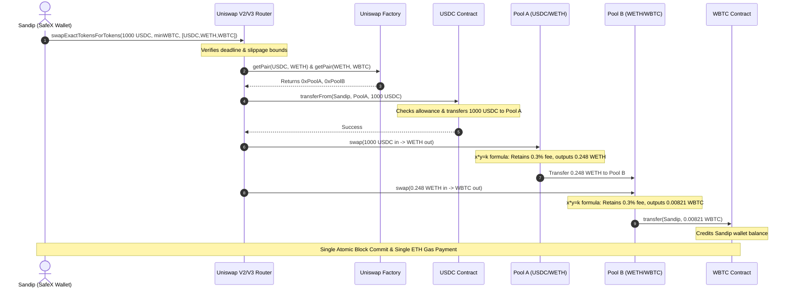

# 🔄 Phase 5 — Decentralized Exchange (DEX) & AMM Architecture (SafeX Handbook)

> **Context**: Comprehensive technical guide to Decentralized Exchange (DEX) mechanics. 
> Covers the underlying mathematics of Constant Product Automated Market Makers ($x \cdot y = k$), dynamic multi-hop path resolution via Factory registries, pre-trade quote simulation, slippage tolerance calculation, and an end-to-end atomic EVM execution trace of a multi-hop token swap.

---

## Table of Contents
* **Phase 5.1 — Mathematical Foundations: Constant Product AMM ($x \cdot y = k$)**
  * 5.1.1 [Why DEXes Don't Need Buyers & Sellers](#511--why-dexes-dont-need-buyers--sellers)
  * 5.1.2 [Liquidity Pool Storage Architecture](#512--liquidity-pool-storage-architecture)
  * 5.1.3 [Why LPs Deposit Equal Value (Not Equal Quantity)](#513--why-lps-deposit-equal-value-not-equal-quantity)
  * 5.1.4 [Understanding the Invariant Curve ($x \cdot y = k$)](#514--understanding-the-invariant-curve-x-cdot-y--k)
  * 5.1.5 [Step-by-Step Swap Mechanics (Algebraic Derivation)](#515--step-by-step-swap-mechanics-algebraic-derivation)
  * 5.1.6 [The 0.30% Fee Retention & Why $k$ Grows](#516--the-030-fee-retention--why-k-grows)
  * 5.1.7 [Price Impact vs. Execution Slippage](#517--price-impact-vs-execution-slippage)
  * 5.1.8 [SafeX AMM Mental Model Table](#518--safex-amm-mental-model-table)
* **Phase 5.2 — Multi-Hop Routing & Path Resolution**
  * 5.2.1 [What Exactly Is a Swap Path?](#521--what-exactly-is-a-swap-path)
  * 5.2.2 [Factory: The Registry of Every Pool](#522--factory-the-registry-of-every-pool)
  * 5.2.3 [How the Router Resolves Every Hop](#523--how-the-router-resolves-every-hop)
  * 5.2.4 [Direct Swap vs. Multi-Hop Swap](#524--direct-swap-vs-multi-hop-swap)
  * 5.2.5 [Why WETH Becomes the Universal Bridge (The Hub Model)](#525--why-weth-becomes-the-universal-bridge-the-hub-model)
  * 5.2.6 [Reading Reserves Across Every Hop](#526--reading-reserves-across-every-hop)
  * 5.2.7 [Complete Multi-Hop Execution Pipeline](#527--complete-multi-hop-execution-pipeline)
  * 5.2.8 [SafeX Swap Quote Engine Architecture](#528--safex-swap-quote-engine-architecture)
  * 5.2.9 [SafeX Routing Mental Model Table](#529--safex-routing-mental-model-table)
* **Phase 5.3 — Quote Engine, Slippage & Minimum Received**
  * 5.3.1 [What Is a Quote Engine?](#531--what-is-a-quote-engine)
  * 5.3.2 [`getAmountOut()` Mathematical Formula & Implementation](#532--getamountout-mathematical-formula--implementation)
  * 5.3.3 [Multi-Hop Quote Calculation (`getAmountsOut`)](#533--multi-hop-quote-calculation-getamountsout)
  * 5.3.4 [Price Impact vs. Slippage: Detailed Comparison](#534--price-impact-vs-slippage-detailed-comparison)
  * 5.3.5 [Minimum Received (`amountOutMin`) & Revert Defense](#535--minimum-received-amountoutmin--revert-defense)
  * 5.3.6 [Deadline Protection](#536--deadline-protection)
  * 5.3.7 [SafeX Complete Quote Engine Pipeline](#537--safex-complete-quote-engine-pipeline)
  * 5.3.8 [SafeX Quote Engine Mental Model Table](#538--safex-quote-engine-mental-model-table)
* **Phase 5.4 — Atomic Execution, MEV & Sandwich Protection**
  * 5.4.1 [What Happens After SafeX Broadcasts a Swap?](#541--what-happens-after-safex-broadcasts-a-swap)
  * 5.4.2 [Mempool: Ethereum's Waiting Room](#542--mempool-ethereums-waiting-room)
  * 5.4.3 [MEV (Maximal Extractable Value)](#543--mev-maximal-extractable-value)
  * 5.4.4 [Sandwich Attack (Step-by-Step Breakdown)](#544--sandwich-attack-step-by-step-breakdown)
  * 5.4.5 [`amountOutMin` Is Your Shield](#545--amountoutmin-is-your-shield)
  * 5.4.6 [Deadline: Protection Against Stale Quotes](#546--deadline-protection-against-stale-quotes)
  * 5.4.7 [Private RPC & MEV Protection Relays](#547--private-rpc--mev-protection-relays)
  * 5.4.8 [Atomic Execution: All or Nothing](#548--atomic-execution-all-or-nothing)
  * 5.4.9 [SafeX Security & Mental Model Matrix](#549--safex-security--mental-model-matrix)
* **Phase 5.5 — Receipt Event Logs & Swap Route Decoding**
  * 5.5.1 [Transaction Object vs. Transaction Receipt](#551--transaction-object-vs-transaction-receipt)
  * 5.5.2 [Why One Swap Produces Many Event Logs](#552--why-one-swap-produces-many-event-logs)
  * 5.5.3 [Anatomy of an EVM Event Log](#553--anatomy-of-an-evm-event-log)
  * 5.5.4 [`Transfer` Events vs. `Swap` Events](#554--transfer-events-vs-swap-events)
  * 5.5.5 [Reconstructing `USDC → WETH → WBTC` Route](#555--reconstructing-usdc--weth--wbtc-route)
  * 5.5.6 [How SafeX Decodes Logs Using ABI (`viem`)](#556--how-safex-decodes-logs-using-abi-viem)
  * 5.5.7 [Building the SafeX Transaction History Card](#557--building-the-safex-transaction-history-card)
  * 5.5.8 [SafeX Mental Model Matrix & Theory Milestone Recap](#558--safex-mental-model-matrix--theory-milestone-recap)
* **Phase 5.6 — End-to-End Atomic Execution Trace (USDC → WETH → WBTC)**
  * [Architecture Before Anything Happens](#-architecture-before-anything-happens)
  * [Steps 1–12: Complete Atomic Lifecycle](#step-1--safex-builds-the-transaction)
  * [Full Mermaid Sequence Diagram](#-the-entire-swap-lifecycle-in-one-diagram)
  * [SafeX Engineer's Mental Model](#-safex-engineers-mental-model)

---

# Phase 5.1 — Mathematical Foundations: Constant Product AMM ($x \cdot y = k$)

## 5.1.1 — Why DEXes Don't Need Buyers & Sellers

### Centralized Exchange (CEX) Order Books
In a traditional order book exchange (e.g. Binance, NASDAQ):
* **Matching Mechanism**: A centralized matching engine sorts resting limit orders in an off-chain order book (Bids vs. Asks).
* **Counterparty**: There are always two distinct humans. Alice sells 1 ETH, and Bob buys 1 ETH. The exchange matches their orders at an agreed price.
* **Limitation on Blockchains**: Maintaining high-frequency order books with constant cancel/replace orders on-chain is prohibitively expensive due to block times, gas fees, and state bloat.

### Decentralized Automated Market Maker (AMM)
A DEX like Uniswap eliminates the order book entirely:

| Entity | Action |
| :--- | :--- |
| **Trader** | Deposits Token A (e.g. USDC) into the smart contract pool. |
| **Pool Contract** | Programmatically dispenses Token B (e.g. WETH) back to the trader. |

> **Core Axiom**: *The liquidity pool contract is always your counterparty.* 
> You never wait for a buyer or seller. You trade directly against pooled reserves locked in EVM state.

---

## 5.1.2 — Liquidity Pool Storage Architecture

A liquidity pool is simply an independent smart contract deployed by a Factory. It maintains persistent state variables representing the reserves of exactly two ERC-20 tokens.

```text
┌─────────────────────────────────────────────────────────────────────────────────┐
│                    USDC / WETH LIQUIDITY POOL SMART CONTRACT                    │
├─────────────────────────────────────────────────────────────────────────────────┤
│ Immutable Identity (Constants):                                                 │
│   token0 = 0xA0b86991c6218b36c1d19D4a2e9Eb0cE3606eB48  (USDC)                  │
│   token1 = 0xC02aaA39b223FE8D0A0e5C4F27eAD9083C756Cc2  (WETH)                  │
├─────────────────────────────────────────────────────────────────────────────────┤
│ Persistent State Variables (EVM Storage Slots):                                 │
│   reserve0 = 12,000,000 * 10^6   (12,000,000 USDC)                              │
│   reserve1 = 3,000 * 10^18       (3,000 WETH)                                   │
│   blockTimestampLast = 1757390000                                               │
├─────────────────────────────────────────────────────────────────────────────────┤
│ LP Share Accounting:                                                            │
│   totalSupply = Total minted LP ERC-20 tokens                                   │
│   balanceOf[LP_Address] = LP ownership shares of this pool                      │
└─────────────────────────────────────────────────────────────────────────────────┘
```

> [!NOTE]
> These reserves live inside the **pool contract's private storage slots**, updated during every swap. They are entirely separate from global Ethereum account balances.

---

## 5.1.3 — Why LPs Deposit Equal Value (Not Equal Quantity)

When creating or funding a pool, Liquidity Providers (LPs) must deposit **equal USD value** on both sides of the pair, not equal token quantities.

### Example: Creating a USDC / WETH Pool
Assume the external market price of ETH is **$4,000 USDC**:

| Deposit Side | Quantity Deposited | Implied USD Value |
| :--- | :--- | :--- |
| **Token A (USDC)** | `12,000,000 USDC` | $\approx \$12,000,000$ |
| **Token B (WETH)** | `3,000 WETH` | $3,000 \times \$4,000 = \$12,000,000$ |

### Why Not Equal Quantities?
If an LP deposited `100 USDC` and `100 WETH`, the pool's ratio would imply that:
$$1\text{ WETH} = 1\text{ USDC}$$
Arbitrageurs would instantly drain the underpriced WETH from the pool until the ratio reflected true global market prices, causing massive capital loss for the depositor.

### Initial Price is Derived, Never Stored
An AMM pool does not store a price variable. Price is dynamically derived from the ratio of its reserves:

$$\text{Price}_{\text{ETH}} = \frac{\text{Reserve}_{\text{USDC}}}{\text{Reserve}_{\text{WETH}}} = \frac{12,000,000}{3,000} = 4,000\text{ USDC}$$

---

## 5.1.4 — Understanding the Invariant Curve ($x \cdot y = k$)

The constant product formula governs all swaps:

$$x \cdot y = k$$

Where:
* $x$: Current reserve of Token A (`reserve0`, e.g. USDC).
* $y$: Current reserve of Token B (`reserve1`, e.g. WETH).
* $k$: The constant invariant product.

```text
Reserve Y (WETH)
  ▲
  │  \
  │   \  (x * y = k)
  │    \  ◄─── AMM Hyperbolic Curve
  │     •  State Before Swap (12M USDC, 3,000 WETH)
  │      \
  │       \
  │        •  State After Swap (12.001M USDC, 2,999.75 WETH)
  │         \
  └───────────\────────────────────────► Reserve X (USDC)
```

### Calculating Initial $k$
$$k = 12,000,000 \times 3,000 = 36,000,000,000$$

A trade moves the pool's state along this hyperbolic curve. When a user adds $x$, the contract must calculate the exact amount of $y$ to release so that the remaining reserves maintain the invariant.

---

## 5.1.5 — Step-by-Step Swap Mechanics (Algebraic Derivation)

### Scenario: Swapping 1,000 USDC for WETH (Zero-Fee Baseline)
Let $x = 12,000,000$, $y = 3,000$, and $k = 36,000,000,000$.

1. **User deposits $\Delta x = 1,000\text{ USDC}$**:
   $$x_{\text{new}} = x + \Delta x = 12,000,000 + 1,000 = 12,001,000$$

2. **Calculate required new WETH reserve ($y_{\text{new}}$)**:
   $$y_{\text{new}} = \frac{k}{x_{\text{new}}} = \frac{36,000,000,000}{12,001,000} \approx 2,999.75002083\text{ WETH}$$

3. **Calculate WETH released to user ($\Delta y$)**:
   $$\Delta y = y - y_{\text{new}} = 3,000 - 2,999.75002083 = \mathbf{0.24997917\text{ WETH}}$$

4. **Effective Execution Price**:
   $$\text{Price} = \frac{1,000\text{ USDC}}{0.24997917\text{ WETH}} \approx 4,000.33\text{ USDC per ETH}$$

---

## 5.1.6 — The 0.30% Fee Retention & Why $k$ Grows

In production AMMs (Uniswap V2), a **0.30% liquidity fee** is retained on every swap.

### How the Fee is Applied
When a user submits $1,000\text{ USDC}$:
* **Gross Inflow**: $1,000\text{ USDC}$ physically enters the pool.
* **Fee**: $1,000 \times 0.003 = 3\text{ USDC}$.
* **Net Inflow for Pricing**: $\Delta x_{\text{effective}} = 997\text{ USDC}$.

```text
┌─────────────────────────────────────────────────────────────┐
│                      WHERE THE FEE GOES                     │
├──────────────────────────────────────────────┬──────────────┤
│ User Sends to Pool                           │ 1,000 USDC   │
│ Amount Used in x * y = k Calculation         │ 997 USDC     │
│ Retained in Pool Reserves (LP Reward)        │ 3 USDC       │
│ Total Added to Pool Storage reserve0         │ +1,000 USDC  │
└──────────────────────────────────────────────┴──────────────┘
```

### The Invariant Proof: Why $k$ Increases
Because the full $1,000\text{ USDC}$ enters the pool while the outgoing WETH is calculated using only $997\text{ USDC}$, the new invariant product $k$ actually grows:

* **New Reserves**:
  * $x_{\text{new}} = 12,000,000 + 1,000 = 12,001,000\text{ USDC}$
  * $y_{\text{new}} = 3,000 - 0.2492305 = 2,999.7507695\text{ WETH}$
* **New $k$**:
  $$k_{\text{new}} = 12,001,000 \times 2,999.7507695 = \mathbf{36,000,008,985} > 36,000,000,000$$

> **Key Insight**: There is no separate "fee wallet" or fee distribution transaction. 
> Fees remain locked in the pool reserves, causing $k$ to grow on every trade. When LPs burn their LP tokens, they redeem their proportional share of this larger pool!

---

## 5.1.7 — Price Impact vs. Execution Slippage

| Dimension | Price Impact | Execution Slippage |
| :--- | :--- | :--- |
| **Definition** | The price shift caused directly by your own trade moving the reserves along the AMM curve. | The price difference between when you sign the tx and when a miner confirms it, caused by *other* transactions. |
| **Origin** | Internal mathematical property of pool depth vs. order size. | Mempool delays, network congestion, or frontrunning / sandwich attacks. |
| **Predictability** | Can be calculated **100% deterministically** before signing. | Probabilistic; defended using `amountOutMin` and `deadline`. |

### Large Swap Demonstration
If a whale swaps **$3,000,000\text{ USDC}$** in the same $12\text{M} / 3\text{k}$ pool:
* $x_{\text{new}} = 15,000,000\text{ USDC}$
* $y_{\text{new}} = \frac{36\text{B}}{15\text{M}} = 2,400\text{ WETH}$
* **New Spot Price**:
  $$\frac{15,000,000}{2,400} = \mathbf{6,250\text{ USDC per ETH}}$$
The pool's price of ETH increased from $\$4,000$ to $\$6,250$ (**56.2% price impact**) because the trade size was substantial relative to total liquidity.

---

## 5.1.8 — SafeX AMM Mental Model Table

| Property | Implementation Reality |
| :--- | :--- |
| **Liquidity Pool** | Autonomous smart contract managing paired ERC-20 token reserves. |
| **Pool Reserves** | Persistent EVM storage variables (`reserve0`, `reserve1`) read via `getReserves()`. |
| **Spot Price** | Dynamically derived ratio ($\frac{\text{reserve0}}{\text{reserve1}}$); never hardcoded or stored in state. |
| **Swap Execution** | User deposits one reserve and receives the other calculated via $x \cdot y = k$. |
| **0.30% Fee** | Retained inside reserve balances, permanently increasing $k$ for LP share redemption. |
| **Price Impact** | Movement along the hyperbolic curve determined strictly by swap size vs. pool depth. |

---

# Phase 5.2 — Multi-Hop Routing & Path Resolution

## 5.2.1 — What Exactly Is a Swap Path?

Suppose you hold **USDC** and want to receive **WBTC**.

A direct USDC/WBTC pool might not exist, or its liquidity might be too shallow to absorb your trade without massive price impact. To solve this, the swap router builds a **multi-hop routing path**:

```typescript
const path: `0x${string}`[] = [
  USDC_ADDRESS, // path[0]: Input token you own
  WETH_ADDRESS, // path[1]: Intermediate bridge token
  WBTC_ADDRESS, // path[2]: Output token you want
]
```

```text
┌──────────────┐         ┌──────────────┐         ┌──────────────┐
│  path[0]     │         │  path[1]     │         │  path[2]     │
│  Input Token ├────────►│ Bridge Token ├────────►│ Output Token │
│  (USDC)      │  Hop 1  │  (WETH)      │  Hop 2  │  (WBTC)      │
└──────────────┘         └──────────────┘         └──────────────┘
```

> **The Golden Rule of Swap Paths**:
> A swap path is strictly an **ordered array of ERC-20 token contract addresses**. 
> It never contains pool addresses or router addresses. The router dynamically resolves the corresponding pool contract for each sequential pair of tokens.

---

## 5.2.2 — Factory: The Registry of Every Pool

The **Uniswap Factory** acts as the decentralized "DNS" for liquidity pools on Ethereum. It stores a nested mapping from token pairs to their deployed pool contract addresses:

```solidity
// Factory Storage Mapping
mapping(address => mapping(address => address)) public getPair;
```

```text
┌────────────────────────────────────────────────────────────────────────┐
│                        UNISWAP FACTORY REGISTRY                        │
├────────────────────────────────────────┬───────────────────────────────┤
│ Key (tokenA, tokenB)                   │ Value (Pool Contract Address) │
├────────────────────────────────────────┼───────────────────────────────┤
│ (USDC, WETH)                           │ 0xB4e16d0168e52d35CaCD2c6185b44281Ec28C9Dc │
│ (WETH, WBTC)                           │ 0xBb2b8038a1640196FbE3e3839985767133fe74c3 │
│ (LINK, WETH)                           │ 0xa2107FA5B38d9bbd2C461D6EDf11B11A50F6b974 │
└────────────────────────────────────────┴───────────────────────────────┘
```

> [!NOTE]
> The Factory does not store token balances or reserves. It serves solely as an immutable directory of verified pool contract addresses.

---

## 5.2.3 — How the Router Resolves Every Hop

When the Router receives `path = [USDC, WETH, WBTC]`, it iterates through the array from `i = 0` to `i < path.length - 1`:

| Hop | Step | Factory Query | Resolved Pool Contract |
| :--- | :--- | :--- | :--- |
| **Hop 1** | Token 0 $\rightarrow$ Token 1 | `factory.getPair(USDC, WETH)` | `0xPool_USDC_WETH` |
| **Hop 2** | Token 1 $\rightarrow$ Token 2 | `factory.getPair(WETH, WBTC)` | `0xPool_WETH_WBTC` |

```text
User Input: path = [USDC, WETH, WBTC]
             │
             ├── Hop 1: getPair(USDC, WETH) ──► Pool A (USDC/WETH)
             │
             └── Hop 2: getPair(WETH, WBTC) ──► Pool B (WETH/WBTC)
```

---

## 5.2.4 — Direct Swap vs. Multi-Hop Swap

### Case A: Direct Pool Exists with Deep Liquidity
If you swap **USDC $\rightarrow$ WETH**, `factory.getPair(USDC, WETH)` resolves a pool with massive depth. 
* Path: `[USDC, WETH]` (1 hop, 1 pool).

### Case B: Direct Pool Does Not Exist
If you attempt to swap **USDC $\rightarrow$ WBTC**, querying the factory returns `address(0)`:
```solidity
address directPool = factory.getPair(USDC, WBTC);
// Returns: 0x0000000000000000000000000000000000000000
```
Because no one created or funded a direct `USDC/WBTC` pair, a direct swap is impossible.

### Case C: Bridge Assets to the Rescue
The router automatically routes the trade through a common bridge token:
$$\text{USDC} \overset{\text{Pool A}}{\longrightarrow} \text{WETH} \overset{\text{Pool B}}{\longrightarrow} \text{WBTC}$$
Both Pool A and Pool B exist and have deep liquidity. The trade succeeds seamlessly.

---

## 5.2.5 — Why WETH Becomes the Universal Bridge (The Hub Model)

### The Combinatorial Explosion Problem
If Ethereum has $N = 1,000$ active tokens, creating direct pairs between all of them would require:

$$\text{Total Pairs} = \frac{N(N - 1)}{2} = \frac{1,000 \times 999}{2} = \mathbf{499,500\text{ Liquidity Pools}}$$

Fragmenting liquidity across 500,000 pools would make every individual pool shallow, resulting in extreme price impact.

### The WETH Star-Topology (Hub & Spoke Model)
Instead, every token pairs directly against **WETH**:

$$\text{Total Pools Required} = N = \mathbf{1,000\text{ Liquidity Pools}}$$

```text
        [ USDC ]
           │
           ▼
[ WBTC ] ──► [ WETH HUB ] ◄── [ LINK ]
           ▲
           │
        [ DAI ]
```

---

## 5.2.6 — Reading Reserves Across Every Hop

Before submitting a transaction, SafeX queries the live reserves of each pool to calculate an accurate quote:

### Step 1: Read Pool A Reserves (`USDC/WETH`)
```typescript
const [reserve0_A, reserve1_A] = await poolA.read.getReserves()
// reserveUSDC = 12,000,000 * 10^6
// reserveWETH = 3,000 * 10^18
```

### Step 2: Read Pool B Reserves (`WETH/WBTC`)
```typescript
const [reserve0_B, reserve1_B] = await poolB.read.getReserves()
// reserveWETH = 8,000 * 10^18
// reserveWBTC = 120 * 10^8
```

### Consolidated Reserve Table

| Pool | Asset 0 Reserve | Asset 1 Reserve | Spot Ratio |
| :--- | :--- | :--- | :--- |
| **Pool A (`USDC/WETH`)** | `12,000,000 USDC` | `3,000 WETH` | $1\text{ WETH} = 4,000\text{ USDC}$ |
| **Pool B (`WETH/WBTC`)** | `8,000 WETH` | `120 WBTC` | $1\text{ WBTC} = 66.66\text{ WETH}$ |

---

## 5.2.7 — Complete Multi-Hop Execution Pipeline

```text
┌─────────────────────────────────────────────────────────────────────────────┐
│                       ATOMIC MULTI-HOP PIPELINE                             │
├─────────────────────────────────────────────────────────────────────────────┤
│ 1. User signs ONE transaction to Uniswap Router:                            │
│    swapExactTokensForTokens(1000 USDC, minWBTC, [USDC, WETH, WBTC], User)   │
│                                                                             │
│ 2. Router calls USDC.transferFrom(User, PoolA, 1000 USDC)                   │
│                                                                             │
│ 3. Pool A calculates output: 1000 USDC -> 0.249 WETH                        │
│    Pool A transfers 0.249 WETH DIRECTLY to Pool B                           │
│                                                                             │
│ 4. Pool B calculates output: 0.249 WETH -> 0.00374 WBTC                     │
│    Pool B transfers 0.00374 WBTC DIRECTLY to User's Wallet                  │
└─────────────────────────────────────────────────────────────────────────────┘
```

> **Crucial Architecture Insight**:
> The user **never receives or touches intermediate WETH**. 
> Pool A forwards intermediate WETH directly to Pool B as part of internal contract execution, saving significant gas fees.

> [!WARNING]
> 🟡 **Infographic Guide**: To understand flow of swapping, [click here to view detailed infographics](./infographics/swapping_flow.png).

---

## 5.2.8 — SafeX Swap Quote Engine Architecture

```typescript
// 1. Resolve Best Path
const path = await resolveSwapPath(tokenIn, tokenOut) // [USDC, WETH, WBTC]

// 2. Fetch Pair Contracts from Factory
const poolAddresses = await Promise.all([
  factory.read.getPair([path[0], path[1]]),
  factory.read.getPair([path[1], path[2]]),
])

// 3. Query Real-Time Reserves via Multi-Call
const reserves = await fetchReservesMultiCall(poolAddresses)

// 4. Compute Mathematical Output (AMM Formula with 0.3% fee)
const amountsOut = computeAmountsOut(amountIn, reserves)

// 5. Calculate Minimum Received Based on Slippage
const amountOutMin = calculateSlippageBound(amountsOut[amountsOut.length - 1], slippageTolerance)
```

---

## 5.2.9 — SafeX Routing Mental Model Table

| Concept | What It Actually Is |
| :--- | :--- |
| **`path`** | An array of token addresses (`[USDC, WETH, WBTC]`); never pool addresses. |
| **Factory** | The on-chain directory mapping `(tokenA, tokenB) => pairAddress`. |
| **Router** | The orchestrator contract that decodes the path and executes the hops. |
| **Bridge Asset** | WETH, serving as the central hub connecting fragmented token pools. |
| **Internal Handoff** | Intermediate tokens move directly between pools, never entering user wallets. |
| **Transaction Boundary** | The entire multi-hop sequence executes in **one atomic transaction**. |

---

# Phase 5.3 — Quote Engine, Slippage & Minimum Received

## 5.3.1 — What Is a Quote Engine?

When a user selects **1,000 USDC $\rightarrow$ WBTC** in the SafeX Swap interface:

```text
┌─────────────────────────────────────────────────────────┐
│                       SAFEX SWAP UI                     │
├─────────────────────────────────────────────────────────┤
│ Pay: 1,000 USDC                                         │
│ Receive (Estimated): 0.003742 WBTC                      │
│ Price Impact: 0.12%                                     │
│ Minimum Received (0.5% Slippage): 0.003723 WBTC         │
│ Network Fee: ~$2.15 (0.00085 ETH)                       │
└─────────────────────────────────────────────────────────┘
```

Before signing anything, SafeX already knows:
1. Expected output tokens based on current reserves.
2. The exact price impact.
3. The worst-case guaranteed execution floor (`amountOutMin`).
4. The transaction execution deadline.

**No transaction is signed or broadcast.** The Quote Engine performs local off-chain simulation using live blockchain state.

---

## 5.3.2 — `getAmountOut()` Mathematical Formula & Implementation

This is the exact mathematical formula implemented in the Uniswap V2 Pair contract:

### Mathematical Derivation
Given reserves $R_{\text{in}}$ and $R_{\text{out}}$, when a user supplies $\Delta x$:

$$\Delta x_{\text{withFee}} = \Delta x \times 997$$

$$\text{Numerator} = \Delta x_{\text{withFee}} \times R_{\text{out}}$$

$$\text{Denominator} = (R_{\text{in}} \times 1,000) + \Delta x_{\text{withFee}}$$

$$\Delta y = \frac{\text{Numerator}}{\text{Denominator}}$$

### Concrete Calculation
* $R_{\text{in}} = 12,000,000\text{ USDC}$ ($12,000,000 \times 10^6$ base units)
* $R_{\text{out}} = 3,000\text{ WETH}$ ($3,000 \times 10^{18}$ base units)
* $\Delta x = 1,000\text{ USDC}$ ($1,000 \times 10^6$ base units)

1. $\Delta x_{\text{withFee}} = (1,000 \times 10^6) \times 997 = 997,000,000,000$
2. $\text{Numerator} = 997,000,000,000 \times (3,000 \times 10^{18}) = 2.991 \times 10^{33}$
3. $\text{Denominator} = ((12,000,000 \times 10^6) \times 1,000) + 997,000,000,000 = 1.2000997 \times 10^{16}$
4. $\Delta y = \frac{2.991 \times 10^{33}}{1.2000997 \times 10^{16}} \approx \mathbf{0.249229\text{ WETH}}$

### Solidity Reference Implementation
```solidity
function getAmountOut(
    uint amountIn,
    uint reserveIn,
    uint reserveOut
) internal pure returns (uint amountOut) {
    require(amountIn > 0, "INSUFFICIENT_INPUT_AMOUNT");
    require(reserveIn > 0 && reserveOut > 0, "INSUFFICIENT_LIQUIDITY");
    
    uint amountInWithFee = amountIn * 997;
    uint numerator = amountInWithFee * reserveOut;
    uint denominator = (reserveIn * 1000) + amountInWithFee;
    amountOut = numerator / denominator;
}
```

### SafeX Client TypeScript (`BigInt`) Implementation
```typescript
export function getAmountOut(
  amountIn: bigint,
  reserveIn: bigint,
  reserveOut: bigint
): bigint {
  if (amountIn <= 0n) throw new Error('Insufficient input amount')
  if (reserveIn <= 0n || reserveOut <= 0n) throw new Error('Insufficient liquidity')

  const amountInWithFee = amountIn * 997n
  const numerator = amountInWithFee * reserveOut
  const denominator = (reserveIn * 1000n) + amountInWithFee

  return numerator / denominator
}
```

> **Design Principle**:
> Uses strictly `bigint` arithmetic. Zero JavaScript IEEE-754 floating-point numbers are used, ensuring 100% deterministic bit-for-bit equivalence with EVM execution.

---

## 5.3.3 — Multi-Hop Quote Calculation (`getAmountsOut`)

For a multi-hop path `[USDC, WETH, WBTC]`:

1. **Hop 1**: Run `getAmountOut(1000 USDC, reserveUSDC_A, reserveWETH_A)` $\rightarrow$ yields `0.24923 WETH`.
2. **Hop 2**: Take `0.24923 WETH` as input for Pool B: `getAmountOut(0.24923 WETH, reserveWETH_B, reserveWBTC_B)` $\rightarrow$ yields `0.003738 WBTC`.

### Uniswap Router ABI Call:
```solidity
function getAmountsOut(uint amountIn, address[] memory path) 
    public view returns (uint[] memory amounts);
```
SafeX can either compute this locally or query `router.read.getAmountsOut([amountIn, path])` via `eth_call` (0 gas cost) to verify reserves in a single network round-trip.

---

## 5.3.4 — Price Impact vs. Slippage: Detailed Comparison

```text
Time t0 (SafeX Quote):           Time t1 (Pending in Mempool):     Time t2 (Block Ingestion):
┌─────────────────────────┐      ┌─────────────────────────┐       ┌─────────────────────────┐
│ User sees quote:        │      │ Frontrunner swaps:      │       │ User tx executes:       │
│ Expected: 0.003738 WBTC │ ───► │ Pool reserves shift!    │ ────► │ Received: 0.003701 WBTC │
│ Price Impact: 0.12%     │      │                         │       │ (Diff is Slippage!)     │
└─────────────────────────┘      └─────────────────────────┘       └─────────────────────────┘
```

| Metric | Price Impact | Execution Slippage |
| :--- | :--- | :--- |
| **What It Is** | The price shift caused directly by **your own transaction size**. | The price difference caused by **other people's transactions** confirmed ahead of you. |
| **Cause** | Movement along the mathematical $x \cdot y = k$ curve. | Time delay between signing and mining (mempool queue, MEV arbitrage). |
| **Predictability** | **100% Deterministic** (known before signing). | **Probabilistic** (depends on network activity and miners). |
| **Mitigation** | Split large trades into smaller batches or use multi-hop routes. | Set an explicit `amountOutMin` threshold in calldata. |

---

## 5.3.5 — Minimum Received (`amountOutMin`) & Revert Defense

`amountOutMin` is the most critical user defense parameter in DEX trading.

### Mathematical Formulation
Given an expected output $O$ and a user slippage tolerance $S$ (e.g. $0.5\% = 0.005$):

$$\text{amountOutMin} = \text{expectedOutput} \times (1 - S)$$

$$\text{amountOutMin} = 0.003738 \times (1 - 0.005) = \mathbf{0.00371931\text{ WBTC}}$$

### In-EVM Enforcement
SafeX inserts `amountOutMin` directly into the calldata. When the Router finishes the final hop:

```solidity
require(amounts[amounts.length - 1] >= amountOutMin, "UniswapV2Router: INSUFFICIENT_OUTPUT_AMOUNT");
```

* **If actual output $\ge 0.003719$ WBTC**: Transaction succeeds; tokens are credited.
* **If actual output $< 0.003719$ WBTC**: The entire transaction reverts atomically. 
  * The user pays only the base gas fee consumed.
  * Zero USDC or WBTC is lost.
  * Protects users against predatory MEV sandwich attacks.

---

## 5.3.6 — Deadline Protection

Ethereum transactions broadcast to the public mempool can occasionally sit pending for hours if gas prices spike.

If a transaction confirmed 3 hours later when market prices had crashed 30%, executing at the old price would cause severe financial loss.

### The Deadline Parameter
SafeX sets the `deadline` parameter:

$$\text{Deadline} = \text{currentBlockTimestamp} + \text{ttlSeconds}$$

```solidity
require(block.timestamp <= deadline, "UniswapV2Router: EXPIRED");
```

* **Default**: 20 minutes ($1,200$ seconds).
* If miners ingest the transaction after the deadline, the EVM immediately reverts execution.

---

## 5.3.7 — SafeX Complete Quote Engine Pipeline

```text
┌────────────────────────────────────────────────────────────────────────┐
│                        SAFEX QUOTE ENGINE PIPELINE                     │
└───────────────────────────────────┬────────────────────────────────────┘
                                    │
                                    ▼
       1. User Input: "1,000 USDC" -> "WBTC", Slippage = 0.5%
                                    │
                                    ▼
       2. Resolve Path: [USDC_ADDRESS, WETH_ADDRESS, WBTC_ADDRESS]
                                    │
                                    ▼
       3. Factory Queries: getPair(USDC, WETH) & getPair(WETH, WBTC)
                                    │
                                    ▼
       4. Multicall RPC: getReserves() for Pool A & Pool B
                                    │
                                    ▼
       5. Run getAmountOut() for Hop 1: 1000 USDC -> 0.24923 WETH
                                    │
                                    ▼
       6. Run getAmountOut() for Hop 2: 0.24923 WETH -> 0.003738 WBTC
                                    │
                                    ▼
       7. Calculate Price Impact: compare spot price vs effective price
                                    │
                                    ▼
       8. Compute Slippage Floor: amountOutMin = 0.003738 * 0.995
                                    │
                                    ▼
       9. Set Deadline: block.timestamp + 1200 seconds
                                    │
                                    ▼
      10. Output Quote to UI (Ready for Offline ECDSA Signing)
```

---

## 5.3.8 — SafeX Quote Engine Mental Model Table

| Component | Responsibility |
| :--- | :--- |
| **Quote Engine** | Off-chain simulation using live pool reserves to preview swap results. |
| **`getAmountOut()`** | Pure function calculating token output for one pool with 0.3% fee deduction. |
| **`getAmountsOut()`** | Sequential execution of `getAmountOut()` across each hop in a multi-hop path. |
| **Price Impact** | Internal price change caused by your trade size vs. pool depth. |
| **Slippage** | External price change caused by other mempool transactions mined before yours. |
| **`amountOutMin`** | Strict on-chain revert threshold protecting users from unfavorable execution. |
| **`deadline`** | Timestamp ceiling after which miners are forbidden from executing the swap. |

---

# 🔄 Phase 5.4 — Atomic Execution, MEV & Sandwich Protection

> **The Security Brain of DeFi.**
> Everything learned so far explains how swaps work. This chapter explains how swaps get attacked and how SafeX defends the user.

---

### 📚 Table of Contents — Phase 5.4

| Section | Topic |
| :--- | :--- |
| **5.4.1** | What Happens After SafeX Broadcasts a Swap? |
| **5.4.2** | Mempool — Ethereum's Waiting Room |
| **5.4.3** | MEV (Maximal Extractable Value) |
| **5.4.4** | Sandwich Attack Step-by-Step |
| **5.4.5** | Why `amountOutMin` Saves Users |
| **5.4.6** | Deadline Protection: Guarding Against Stale Quotes |
| **5.4.7** | Private RPC & MEV Protection Relays |
| **5.4.8** | Atomic Execution: All or Nothing |
| **5.4.9** | SafeX Security & Mental Model Matrix |

---

## 5.4.1 — What Happens After SafeX Broadcasts a Swap?

When SafeX signs and broadcasts a swap transaction:
```typescript
{
  to: UNISWAP_ROUTER_ADDRESS,
  data: swapExactTokensForTokens(...),
  gas: ...,
  maxFeePerGas: ...,
  maxPriorityFeePerGas: ...
}
```

It is tempting to imagine validators execute it immediately. In reality, there is an intermediate staging area:

```text
┌──────────────┐          ┌───────────────────────┐          ┌───────────────┐
│ SafeX Wallet │ ───────> │   Ethereum Mempool    │ ───────> │   Validator   │
│  (Broadcast) │          │ (Public Waiting Room) │          │  (Block Prod) │
└──────────────┘          └───────────────────────┘          └───────────────┘
```

Every public transaction first enters the node **mempool**. This waiting room is where MEV occurs.

---

## 5.4.2 — Mempool: Ethereum's Waiting Room

### What Is the Mempool?
Every Ethereum node maintains an in-memory queue of pending, valid transactions waiting to be included in a block.

| Layer | Type & Lifecycle | Function |
| :--- | :--- | :--- |
| **Blockchain** | Permanent on-chain state | Append-only ledger committed by validator consensus. |
| **Mempool** | Temporary volatile RAM cache | Local node queue holding transactions awaiting inclusion. |

The mempool is **not stored on-chain**. Each node gossips pending transactions via peer-to-peer (P2P) networking.

```text
┌────────────────────────────────────────────────────────────────────────┐
│                        PUBLIC ETHEREUM MEMPOOL                         │
├────────────────────────────────────────────────────────────────────────┤
│ [TX 1] Alice   ── Swap 1,000 USDC -> WBTC (maxPriority: 2 Gwei)        │
│ [TX 2] Bob     ── Transfer 0.5 ETH        (maxPriority: 1.5 Gwei)      │
│ [TX 3] Charlie ── Approve LINK            (maxPriority: 1 Gwei)        │
│ [TX 4] MEV Bot ── Monitoring pending pool txs & calculating bundles... │
└────────────────────────────────────────────────────────────────────────┘
```

> [!IMPORTANT]
> **Transaction Calldata Is Fully Public!**
> Transactions are only encrypted during client-side signing to produce ECDSA `(r, s, v)`. Once broadcast to the P2P network, **all calldata is plain text**.
> Anyone running an RPC node can inspect:
> - Target Router contract address
> - `amountIn` and `amountOutMin`
> - Routing path (`[USDC, WETH, WBTC]`)
> - Allowed slippage tolerance
> - Transaction deadline timestamp

### Validators Prioritize by Gas Auctions
Validators do not process transactions strictly first-in, first-out (FIFO). They maximize fee revenue by sorting transactions by:
1. Higher `maxPriorityFeePerGas` (tip paid directly to the validator/proposer).
2. Higher `maxFeePerGas` (willingness to absorb base fee volatility).

MEV searcher bots leverage this economic incentive to inject transactions ahead of or behind target transactions.

---

## 5.4.3 — MEV (Maximal Extractable Value)

> **MEV Definition**: The profit a validator or searcher bot can extract by arbitrarily reordering, inserting, or censoring transactions within a block.

MEV is not a cryptographic compromise or smart contract bug; it is an economic phenomenon stemming from transaction ordering control in permissionless mempools.

### Common Types of MEV

| Type | Strategy | User Impact |
| :--- | :--- | :--- |
| **Frontrunning** | Submitting a duplicate or related tx with higher gas to execute *before* the victim. | Victim experiences worse price or missed opportunity. |
| **Backrunning** | Submitting a transaction with identical or lower priority to execute *immediately after* a large trade or oracle update. | Captures liquidations or pool rebalancing without harming the victim. |
| **Sandwich Attack** | Executing a Frontrun Buy + Victim Swap + Backrun Sell in the same block. | Direct extraction of user funds via artificial price slippage. |
| **Liquidations** | Monitoring lending markets (Aave, Compound) to trigger liquidation of underwater loans the instant an oracle updates. | Maintains DeFi solvency, but bots compete fiercely in gas wars. |
| **DEX Arbitrage** | Equalizing price differences between Uniswap, Sushiswap, and Curve after a trade moves reserves. | Restores market price equilibrium across pools. |

---

## 5.4.4 — Sandwich Attack (Step-by-Step Breakdown)

> [!WARNING]
> 🟡 **Infographic Guide**: To understand how a sandwich attack works, [click here to view detailed infographics](./infographics/Sandwich_attack.png).

The sandwich attack is the most common and damaging attack on decentralized exchange traders.

### Scenario: Alice Swaps 1,000 USDC for ETH

```text
                                SANDWICH TIMELINE
─────────────────────────────────────────────────────────────────────────────────
     (1) Alice Broadcasts      ──> Sees 1,000 USDC swap, slippage = 1%
              │
     (2) Bot Frontruns (Buy)   ──> Bot buys ETH with high gas tip; price climbs
              │
     (3) Alice's Swap Executes ──> Alice buys ETH at artificially inflated price
              │
     (4) Bot Backruns (Sell)   ──> Bot sells ETH back into pool; captures profit
─────────────────────────────────────────────────────────────────────────────────
```

### Step 1 — Alice Broadcasts to Public Mempool
Alice constructs her swap transaction with `amountIn = 1,000 USDC`, expecting `~0.249 ETH` with `1.0%` slippage tolerance. The transaction sits in the public mempool.

### Step 2 — Bot Frontruns (Pumps ETH Price)
An MEV searcher bot spots Alice's transaction in the mempool. The bot submits a buy transaction (e.g., `500,000 USDC → ETH`) with a substantially higher `maxPriorityFeePerGas`.
- The block builder / validator places the bot's transaction **first**.
- As the bot buys ETH, pool reserves shift according to $x \cdot y = k$.
- ETH becomes significantly more expensive in the pool.

### Step 3 — Alice's Swap Executes at Worst Price
Alice's transaction executes immediately after the bot's buy:
- Alice expected `0.249 ETH`.
- Because of the bot's price shock, Alice receives only `0.243 ETH` (pushed right to the edge of her 1% slippage limit).
- Alice's $1,000\text{ USDC}$ further pumps the price of ETH.

### Step 4 — Bot Backruns (Dumps ETH for Profit)
The bot's second transaction executes immediately behind Alice:
- The bot sells back the ETH acquired in Step 2 for USDC.
- Because Alice's trade pushed ETH price even higher, the bot receives more USDC than it originally spent.
- The liquidity pool reserves return near their original equilibrium.
- **Bot Profit**: Pure arbitrage revenue minus validator gas bribes.
- **Victim Loss**: Alice permanently lost `0.006 ETH` of value.

### Why Large Swaps and High Slippage Are Targeted
MEV searchers filter the mempool for:
- Large trade volumes (large reserve impact).
- Loose slippage tolerance (`> 1%`).
- Standard public mempool routes.
Small retail swaps ($50–$200) are typically ignored because validator gas bribes exceed potential sandwich profits.

---

## 5.4.5 — `amountOutMin` Is Your Shield

`amountOutMin` is the client-side cryptographic defense against sandwich attacks.

```text
               ┌──────────────────────────────────────────────┐
               │         Quote Preview: 0.249 ETH             │
               │         Slippage Setting: 0.5%               │
               ├──────────────────────────────────────────────┤
               │   amountOutMin = 0.249 * (1 - 0.005)         │
               │   amountOutMin = 0.24775 ETH                 │
               └──────────────────────┬───────────────────────┘
                                      │ Enforced by Uniswap Router
                                      ▼
                        if (actualOut < amountOutMin) {
                            revert("UniswapV2Router: INSUFFICIENT_OUTPUT_AMOUNT");
                        }
```

### Router Contract Enforcement
When the Uniswap Router executes pool hops, it validates:
```solidity
require(amounts[amounts.length - 1] >= amountOutMin, "UniswapV2Router: INSUFFICIENT_OUTPUT_AMOUNT");
```

### Outcome Comparison

| Feature | Without `amountOutMin` (`amountOutMin = 0`) | With `amountOutMin` (Strict SafeX Engine) |
| :--- | :--- | :--- |
| **Sandwich Risk** | Bot drains maximum pool value; user absorbs total slippage. | Bot cannot push price past tolerance threshold without reverting the bundle. |
| **Execution Outcome** | Trade succeeds with severe hidden loss. | If attacked, the transaction reverts; principal tokens remain in wallet. |
| **User Balance** | Substantially fewer received tokens. | 100% of swapped tokens retained; only gas fee spent on compute. |

> [!NOTE]
> Even when a transaction reverts, gas is consumed because the EVM performed signature verification, state reads, and bytecode execution before encountering the `revert`.

---

## 5.4.6 — Deadline: Protection Against Stale Quotes

Network congestion or sudden gas spikes can leave transactions pending in the mempool for minutes or hours.

```text
T0: User signs quote (ETH = $3,000) ──> TX stuck in mempool for 45 minutes
                                           │
T+45m: Market crashes (ETH = $2,600)  ──> Miner includes old transaction!
                                           ▼
                                 WITHOUT DEADLINE:
             User gets filled at catastrophic, 45-minute-old rate!
```

### SafeX Enforces Dynamic Deadlines
SafeX stamps every transaction with a timestamp ceiling:
```typescript
const deadline = BigInt(Math.floor(Date.now() / 1000) + 20 * 60); // 20 minutes from now
```

### Router Contract Validation
```solidity
require(block.timestamp <= deadline, "UniswapV2Router: EXPIRED");
```

If network congestion delays block inclusion beyond the deadline, the validator cannot execute the stale swap.

### SafeX Swap Settings Configuration

| Setting | Default | Recommended Bounds | Purpose |
| :--- | :--- | :--- | :--- |
| **Slippage Tolerance** | `0.5%` | `0.1%` – `1.0%` | Prevents MEV sandwich extraction while ensuring trade inclusion. |
| **Transaction Deadline**| `20 mins` | `5 mins` – `30 mins` | Protects against market drift during mempool congestion. |

---

## 5.4.7 — Private RPC & MEV Protection Relays

Modern wallets combat MEV at the network layer using private RPC endpoints.

```text
[Public Mempool Route]:
SafeX ──────> Public RPC (Infura/Alchemy) ──────> Public P2P Mempool ──[MEV Bots Inspect]──> Validator Block

[Private Relay Route]:
SafeX ──────> Flashbots Protect / MEV Blocker ──> Direct to Block Builders (Private) ───────> Validator Block
```

### Public vs. Private RPC Comparison

| Feature | Public RPC (Standard Node) | Private Relay (Flashbots Protect / MEV Blocker) |
| :--- | :--- | :--- |
| **Mempool Visibility** | Broadcast to all public P2P nodes. | Bypasses public mempool; delivered directly to block builders. |
| **Sandwich Exposure** | High risk for large trades. | Complete immunity to public mempool sandwich bots. |
| **Reverted Tx Cost** | User pays gas even if transaction fails. | Failed transactions are dropped without costing gas (on supported builders). |
| **Inclusion Speed** | Standard block propagation. | Slightly delayed (1-2 slots) if private builder share is <100%. |

> [!NOTE]
> SafeX implements standard public RPCs with strict `amountOutMin` and `deadline` guards for testnet learning, with pluggable support for private RPC relays (Flashbots Protect, MEV Blocker) for production mainnet deployments.

---

## 5.4.8 — Atomic Execution: All or Nothing

### Multi-Hop Swap Touches Multiple Smart Contracts
A standard `USDC → WETH → WBTC` multi-hop trade executes through multiple independent contracts:

```text
User EOA
  └── UniswapV2Router.swapExactTokensForTokens()
         ├── USDC.transferFrom(User, PoolA, 1000)
         ├── PoolA (USDC/WETH).swap(...)
         │      └── WETH.transfer(PoolB, 0.248)
         ├── PoolB (WETH/WBTC).swap(...)
         │      └── WBTC.transfer(User, 0.00821)
         └── Finish & Commit
```

### The EVM Rollback Guarantee
If Pool B fails (e.g., `liquidity == 0` or slippage threshold breached):
1. Pool B reverts.
2. Pool A's token transfer reverts.
3. USDC's `transferFrom` reverts.
4. Router execution reverts.

```text
┌──────────────────────────────────────┐       ┌──────────────────────────────────────┐
│       BEFORE TRANSACTION STATE       │       │       AFTER SUCCESSFUL COMMIT        │
├──────────────────────────────────────┤       ├──────────────────────────────────────┤
│ Alice: 1,000 USDC  |  0.00000 WBTC   │       │ Alice: 0 USDC     |  0.00821 WBTC    │
│ PoolA: 5,000,000 U |  1,250.0 WETH   │ ────> │ PoolA: 5,001,000 U|  1,249.75 WETH   │
│ PoolB: 2,000 WETH  |  28.0000 WBTC   │       │ PoolB: 2,000.248 W|  27.9917 WBTC    │
└──────────────────────────────────────┘       └──────────────────────────────────────┘
                   ▲
                   │ If ANY call in the stack reverts:
                   └───────────────────────────────────────────────────
                     All balances snap back 100% to BEFORE state.
```

### Why Gas Still Burns on Reverted Swaps
Validators still execute:
- ECDSA signature verification ($21,000\text{ gas}$)
- Calldata decoding & execution of router bytecode
- State lookups and memory allocations
Gas compensates the network for physical compute and bandwidth consumed up to the moment the `REVERT` opcode was encountered.

---

## 5.4.9 — SafeX Security & Mental Model Matrix

| Concept | Definition & Architectural Role | SafeX Defense |
| :--- | :--- | :--- |
| **Mempool** | Unconfirmed public transaction queue visible to all network participants. | Private RPC support & minimal exposure windows. |
| **MEV** | Value captured by reordering, inserting, or censoring pending transactions. | Strict slippage controls and private relays. |
| **Sandwich Attack** | Frontrunning user's buy order, absorbing slippage, and backrunning to sell for profit. | Strict `amountOutMin` calculation based on live pool reserves. |
| **`amountOutMin`** | Minimum output token threshold encoded directly in router calldata. | Automatic calculation: `quote × (1 - slippagePercent)`. |
| **`deadline`** | Unix timestamp expiration encoded in router calldata. | Default `now + 20 mins` preventing stale quote exploitation. |
| **Private RPC** | Relaying transactions directly to block builders bypassing the P2P mempool. | Optional user setting for MEV-shielded routing. |
| **Atomic Execution** | All-or-nothing EVM transaction guarantee across multiple contract calls. | Single-transaction multi-hop routing with automatic state rollback. |

---

# 🔄 Phase 5.5 — Receipt Event Logs & Swap Route Decoding

> **Closing the Loop on DeFi Swap Mechanics.**
> Until now, we learned how a swap is constructed and executed. Now we learn how SafeX reads the blockchain afterward to reconstruct exactly what took place.
> This is how wallets like SafeX, MetaMask, Rabby, and block explorers like Etherscan turn raw hexadecimal logs into:
> `Swapped 1,000 USDC → 0.00374 WBTC via WETH`

---

### 📚 Table of Contents — Phase 5.5

| Section | Topic |
| :--- | :--- |
| **5.5.1** | Transaction Object vs. Transaction Receipt |
| **5.5.2** | Why One Swap Produces Many Event Logs |
| **5.5.3** | Anatomy of an EVM Event Log |
| **5.5.4** | `Transfer` Events vs. `Swap` Events |
| **5.5.5** | Reconstructing `USDC → WETH → WBTC` Route |
| **5.5.6** | How SafeX Decodes Logs Using ABI (`viem`) |
| **5.5.7** | Building the SafeX Transaction History Card |
| **5.5.8** | SafeX Mental Model Matrix & Theory Milestone Recap |

---

## 5.5.1 — Transaction Object vs. Transaction Receipt

This distinction is foundational for wallet engineers.

### What SafeX Broadcasts (The Intent)
When a user approves a swap, SafeX broadcasts a **transaction request object**:
```typescript
{
  from: '0xAlice...',
  to: UNISWAP_ROUTER_ADDRESS,
  data: '0x38ed1739000000000000000000000000...', // swapExactTokensForTokens(...)
  gasLimit: 180000n,
  maxFeePerGas: 35000000000n,
  maxPriorityFeePerGas: 2000000000n
}
```
This represents **intent** only. It specifies what the user *wants* to happen, but contains zero information about the actual execution outcome or market conditions at mining time.

### What Ethereum Returns (The Receipt / Proof of Execution)
Once mined into a block, the JSON-RPC node returns the immutable **Transaction Receipt**:
```json
{
  "status": "0x1",
  "blockNumber": "0x8cfe70",
  "blockHash": "0x98f2...",
  "transactionHash": "0xabc123...",
  "gasUsed": "0x2670e", 
  "effectiveGasPrice": "0x6fc23ac00",
  "logs": [ ... ]
}
```

### Core Comparison

| Dimension | Transaction Object | Transaction Receipt |
| :--- | :--- | :--- |
| **Temporal State** | Created **before** mining. | Emitted **after** block confirmation. |
| **Nature** | User **intent** & inputs. | Immutable **execution result**. |
| **Data Carried** | Function calldata & gas bid. | Gas actually burned, status code, and emitted event logs. |
| **Status** | Unconfirmed / Pending in mempool. | Confirmed (`status = 1` success, `status = 0` revert). |

---

## 5.5.2 — Why One Swap Produces Many Event Logs

Users sign **one** transaction addressed to the Router, but the receipt contains **5 or more logs**. Why?

During execution, the Uniswap Router internally triggers sub-calls across multiple pre-existing contracts:

```text
               ┌──────────────────────────────────────────────────┐
               │    One User Transaction (To: Uniswap Router)     │
               └────────────────────────┬─────────────────────────┘
                                        │
    ┌────────────────┬──────────────────┼──────────────────┬────────────────┐
    │ Sub-call 1     │ Sub-call 2       │ Sub-call 3       │ Sub-call 4     │ Sub-call 5
    ▼                ▼                  ▼                  ▼                ▼
[USDC Contract]  [Pool A (USDC/WETH)] [WETH Contract]  [Pool B (WETH/WBTC)] [WBTC Contract]
  Transfer Event   Swap Event          Transfer Event   Swap Event          Transfer Event
```

### Log Sequence in Execution Order

| Log Index | Emitting Contract | Event Type | Description |
| :---: | :--- | :--- | :--- |
| **Log 0** | `USDC` Token Contract | `Transfer` | Alice $\rightarrow$ Pool A ($1,000\text{ USDC}$) |
| **Log 1** | Pool A (`USDC/WETH`) | `Swap` | Pool A receives $1,000\text{ USDC}$, emits $0.249\text{ WETH}$ |
| **Log 2** | `WETH` Token Contract | `Transfer` | Pool A $\rightarrow$ Pool B ($0.249\text{ WETH}$) |
| **Log 3** | Pool B (`WETH/WBTC`) | `Swap` | Pool B receives $0.249\text{ WETH}$, emits $0.00374\text{ WBTC}$ |
| **Log 4** | `WBTC` Token Contract | `Transfer` | Pool B $\rightarrow$ Alice ($0.00374\text{ WBTC}$) |

---

## 5.5.3 — Anatomy of an EVM Event Log

Every entry in the receipt `logs` array contains raw hexadecimal primitives:

```text
┌────────────────────────────────────────────────────────────────────────┐
│                        RAW EVM EVENT LOG OBJECT                        │
├─────────────┬──────────────────────────────────────────────────────────┤
│ Field       │ Content                                                  │
├─────────────┼──────────────────────────────────────────────────────────┤
│ address     │ 0xA0b86991c6218b36c1d19D4a2e9Eb0cE3606eB48 (USDC)       │
│ topics[0]   │ 0xddf252ad1be2c89b69c2b068fc378daa952ba7f163c4a116...  │
│ topics[1]   │ 0x000000000000000000000000[AliceAddress]                 │
│ topics[2]   │ 0x000000000000000000000000[PoolAAddress]                  │
│ data        │ 0x00000000000000000000000000000000000000000000000000...  │
└─────────────┴──────────────────────────────────────────────────────────┘
```

### 1. `address`
The contract that executed the `emit` opcode (e.g. USDC token contract, or Pool pair contract).

### 2. `topics[0]` — The Event Signature Hash
`topics[0]` is the Keccak-256 hash of the canonical event signature. For any standard ERC-20 `Transfer`:
$$\text{Topic 0} = \text{keccak256}(\text{"Transfer(address,address,uint256)"})$$
$$\text{Topic 0} = \text{0xddf252ad1be2c89b69c2b068fc378daa952ba7f163c4a11628f55a4df523b3ef}$$

Any EVM client instantly recognizes `0xddf252...` as an ERC-20 token transfer.

### 3. `topics[1..3]` — Indexed Parameters
Solidity events can mark up to 3 parameters as `indexed`:
```solidity
event Transfer(address indexed from, address indexed to, uint256 value);
```
- `topics[1]`: `from` address (32-byte word, 24 leading zero-bytes).
- `topics[2]`: `to` address (32-byte word, 24 leading zero-bytes).
Indexed parameters are stored in the block's **Bloom filter**, enabling instant indexed searching across millions of blocks without downloading full state.

### 4. `data` — Non-Indexed Parameters
Parameters **not** marked `indexed` (e.g. `uint256 value`) are ABI-encoded in the `data` field payload.

---

## 5.5.4 — `Transfer` Events vs. `Swap` Events

To reconstruct a trade, SafeX distinguishes between token movements and pool reserve updates:

```solidity
// ERC-20 Token Event (Emitted by USDC, WETH, WBTC)
event Transfer(address indexed from, address indexed to, uint256 value);

// Uniswap V2 Pair Event (Emitted by Liquidity Pool)
event Swap(
    address indexed sender,
    uint256 amount0In,
    uint256 amount1In,
    uint256 amount0Out,
    uint256 amount1Out,
    address indexed to
);
```

### Key Differences

| Property | ERC-20 `Transfer` Event | Uniswap Pair `Swap` Event |
| :--- | :--- | :--- |
| **Emitted By** | Token contract (`USDC`, `WETH`, `WBTC`). | Automated Market Maker Pair contract (`Pool A`, `Pool B`). |
| **Perspective** | **Wallet-centric**: Who gave tokens to whom. | **Liquidity-centric**: How pool reserves shifted. |
| **SafeX Role** | Proves user spent $1,000\text{ USDC}$ and received $0.00374\text{ WBTC}$. | Proves intermediate hops and exact execution rates. |

---

## 5.5.5 — Reconstructing `USDC → WETH → WBTC`

SafeX scans the receipt logs and performs route reconstruction:

```text
[Step 1: Outgoing User Transfer]
  USDC.Transfer(from: Alice, to: PoolA, value: 1,000 USDC)
        │
        ▼
[Step 2: Pool A Swap Execution]
  PoolA.Swap(amountIn: 1,000 USDC, amountOut: 0.249 WETH, to: PoolB)
        │
        ▼
[Step 3: Intermediate Hop Transfer]
  WETH.Transfer(from: PoolA, to: PoolB, value: 0.249 WETH)
        │
        ▼
[Step 4: Pool B Swap Execution]
  PoolB.Swap(amountIn: 0.249 WETH, amountOut: 0.00374 WBTC, to: Alice)
        │
        ▼
[Step 5: Incoming User Transfer]
  WBTC.Transfer(from: PoolB, to: Alice, value: 0.00374 WBTC)
```

By connecting token contracts where `Transfer.to == UserAddress` and `Transfer.from == UserAddress`, SafeX deterministically isolates:
- **Input Token**: `USDC` ($1,000$)
- **Bridge Asset**: `WETH` ($0.249$)
- **Output Token**: `WBTC` ($0.00374$)

---

## 5.5.6 — How SafeX Decodes Logs Using ABI (`viem`)

SafeX leverages type-safe ABI decoders to transform raw bytes into strongly typed TypeScript objects:

```typescript
import { decodeEventLog, erc20Abi } from 'viem'
import { uniswapV2PairAbi } from '@/lib/abi/uniswapV2PairAbi'

// 1. Decode standard ERC-20 Transfer
const transferLog = decodeEventLog({
  abi: erc20Abi,
  data: log.data,
  topics: log.topics,
})
// Output:
// {
//   eventName: 'Transfer',
//   args: {
//     from: '0xAlice...',
//     to: '0xPoolA...',
//     value: 1000000000n // 1,000 USDC (6 decimals)
//   }
// }

// 2. Decode Uniswap Pair Swap
const swapLog = decodeEventLog({
  abi: uniswapV2PairAbi,
  data: log.data,
  topics: log.topics,
})
// Output:
// {
//   eventName: 'Swap',
//   args: {
//     sender: '0xUniswapRouter...',
//     amount0In: 1000000000n,
//     amount1In: 0n,
//     amount0Out: 0n,
//     amount1Out: 249000000000000000n, // 0.249 WETH (18 decimals)
//     to: '0xPoolB...'
//   }
// }
```

---

## 5.5.7 — Building the SafeX Transaction History Card

### The Parsed Swap Data Model
SafeX aggregates raw decoded events into a normalized UI payload:

```typescript
export interface SwapHistoryRecord {
  txHash: `0x${string}`
  status: 'confirmed' | 'reverted'
  blockNumber: bigint
  gasUsed: bigint
  effectiveGasPrice: bigint
  tokenIn: {
    address: `0x${string}`
    symbol: 'USDC'
    decimals: 6
    amount: '1000.00'
  }
  tokenOut: {
    address: `0x${string}`
    symbol: 'WBTC'
    decimals: 8
    amount: '0.00374000'
  }
  route: string[] // ['USDC', 'WETH', 'WBTC']
  timestamp: number
}
```

### The Rendered UI Presentation
Instead of confronting users with raw hex logs, SafeX renders a clean, professional activity card:

```text
┌────────────────────────────────────────────────────────────────────────┐
│ 🔄 Token Swap                                             CONFIRMED    │
├────────────────────────────────────────────────────────────────────────┤
│ Swapped:    1,000.00 USDC ──> 0.00374000 WBTC                          │
│ Route:      USDC  ──>  WETH (Bridge)  ──>  WBTC                        │
│ Gas Fee:    157,438 Gas (0.0041 ETH · $12.30)                          │
│ Block:      #9,238,832                                                 │
│ Tx Hash:    0x8a12...f91d ↗ (View on Etherscan)                        │
└────────────────────────────────────────────────────────────────────────┘
```

---

## 5.5.8 — SafeX Mental Model Matrix & Theory Milestone Recap

| Component | Role in SafeX | Technical Source |
| :--- | :--- | :--- |
| **Transaction Object** | Encodes user intent and gas parameters before broadcast. | Client-side ECDSA signing. |
| **Transaction Receipt** | Canonical proof of state execution and gas consumed. | `eth_getTransactionReceipt`. |
| **`topics[0]`** | Keccak-256 event signature identifying the event type. | EVM standard ABI hash. |
| **`Transfer` Event** | Pinpoints exact wallet token deductions and credits. | Emitted by token smart contracts. |
| **`Swap` Event** | Details liquidity pool reserve shifts and intermediate rates. | Emitted by Uniswap pool pairs. |
| **ABI Decoder** | Deserializes raw bytecode data into typed arguments. | `viem.decodeEventLog`. |

---

### 🎓 SafeX Phase 5 Theory Curriculum — Complete! 🎉

| Module | Title | Core Takeaway |
| :---: | :--- | :--- |
| **5.1** | Constant Product AMM | $x \cdot y = k$, reserve ratios, 0.30% fee compounding. |
| **5.2** | Multi-Hop Routing | Factory pool discovery, WETH hub liquidity routing. |
| **5.3** | Quote Engine & Slippage | `getAmountOut()` derivation, `amountOutMin`, and deadline. |
| **5.4** | Atomic Execution & MEV | Mempool vulnerability, sandwich attack vectors, and atomic rollback. |
| **5.5** | Receipt Event Logs | Decoding EVM topics/data into human-readable wallet activity. |

---

# Phase 5.6 — End-to-End Atomic Execution Trace (USDC → WETH → WBTC)

### Scenario: Swap 1,000 USDC → WBTC on Ethereum
* **User Experience**: One click, one signature, one gas payment.
* **Under the Hood**: Multi-hop routing across two distinct pools (`USDC/WETH` and `WETH/WBTC`) committed atomically in a single Ethereum transaction.

---

## 🌍 Architecture Before Anything Happens

All smart contracts involved in the swap pre-exist on Ethereum:

```text
┌────────────────────────────────────────────────────────────────────────────────────────┐
│                        ALL SMART CONTRACTS PRE-EXIST ON ETHEREUM                       │
├─────────────────────────┬──────────────────────────────────────────────────────────────┤
│ Contract / Entity       │ Role & Responsibility                                        │
├─────────────────────────┼──────────────────────────────────────────────────────────────┤
│ 1. Your Wallet (EOA)    │ Holds your USDC and native ETH for gas. Signs transactions.  │
│ 2. USDC Contract        │ Stores USDC balances mapping & allowances table.             │
│ 3. Uniswap Router       │ User-facing entry point; orchestrates multi-hop swaps.       │
│ 4. Uniswap Factory      │ Registry contract; knows every liquidity pool address.       │
│ 5. USDC / WETH Pool (A) │ Holds USDC and WETH reserves; computes x * y = k.            │
│ 6. WETH / WBTC Pool (B) │ Holds WETH and WBTC reserves; computes x * y = k.            │
│ 7. WBTC Contract        │ Stores WBTC balances mapping & token logic.                  │
└─────────────────────────┴──────────────────────────────────────────────────────────────┘
```

> [!WARNING]
> 🟡 **Infographic Guide**: To understand flow of swapping, [click here to view detailed infographics](./infographics/swapping_flow.png).
> 
> **Related Architecture References:**
> - [Complete Transaction Lifecycle](./infographics/complete_transaction_lifecycle.png): End-to-end visualization of how multi-hop transactions transition from wallet construction through the mempool to block confirmation.
> - [EIP-1559 Transaction Anatomy](./infographics/eip1559_transaction_anatomy.png): Visual dissection of the Type-2 envelope contrasting native value transfers (`value > 0`) with DEX router contract calls (`value = 0`, `data = calldata`).

---

## STEP 1 — SafeX Builds the Transaction

The user inputs the swap parameters in the SafeX UI:
* **From**: `1,000 USDC`
* **To**: `WBTC`
* **Slippage Tolerance**: `0.5%`

SafeX constructs one EIP-1559 transaction object:

```typescript
const txRequest = {
  to: UNISWAP_ROUTER_ADDRESS,
  value: 0n, // Zero native ETH sent (it's a token swap, not native currency)
  data: encodeFunctionData({
    abi: uniswapRouterAbi,
    functionName: 'swapExactTokensForTokens',
    args: [
      1000000000n, // amountIn: 1000 USDC (6 decimals: 1000 * 10^6)
      amountOutMin, // Minimum acceptable WBTC after 0.5% slippage
      [USDC_ADDRESS, WETH_ADDRESS, WBTC_ADDRESS], // path: multi-hop route
      userAddress, // recipient: who receives the WBTC
      deadline, // Expiry timestamp (current block timestamp + 20 mins)
    ]
  }),
  chainId: 1, // Ethereum Mainnet (or 11155111 for Sepolia)
  nonce,
  maxFeePerGas,
  maxPriorityFeePerGas,
}
```

### Breakdown of the Calldata (`data`)

| Parameter | Type | Value / Purpose |
| :--- | :--- | :--- |
| **Function Selector** | `bytes4` | `0x38ed1739` (`swapExactTokensForTokens`) |
| **`amountIn`** | `uint256` | `1000000000` (1,000 USDC in 6 decimal units) |
| **`amountOutMin`** | `uint256` | Minimum acceptable WBTC (reverts if sandwich attacks extract value) |
| **`path` ⭐** | `address[]` | `[USDC, WETH, WBTC]` (Routed through deep WETH liquidity pools) |
| **`recipient`** | `address` | Your SafeX wallet address |
| **`deadline`** | `uint256` | Unix timestamp after which miners must reject the transaction |

---

## STEP 2 — SafeX Signs the Payload Offline

The zero-trust client signing engine executes in browser memory:

```text
1. Transaction Object (to, value, data, nonce, gas)
         │
         ▼
2. EIP-1559 RLP Serialization (0x02 || rlp([chainId, nonce, ...]))
         │
         ▼
3. Keccak-256 Hash of serialized payload
         │
         ▼
4. ECDSA Signature in RAM via secp256k1 (produces r, s, yParity)
         │
         ▼
5. Attach Signature to transaction components & serialize to raw hex
```

> **Security Invariant**: The private key is decrypted in volatile RAM, executes the ECDSA signature, and is immediately zeroized via `buffer.fill(0)`. The private key never leaves your local device.

---

## STEP 3 — Ethereum Validators Receive the Transaction

Ethereum validator nodes receive the raw signed bytes via the public P2P mempool:
1. Recovers your public key and Ethereum address via `ecrecover(hash, r, s, v)`.
2. Verifies your nonce and verifies your EOA has enough native ETH to pay for gas.
3. Loads the transaction into the EVM and begins executing the **Uniswap Router's bytecode**.

---

## STEP 4 — Router Decodes the Calldata

The EVM executes the Uniswap Router function:
```solidity
swapExactTokensForTokens(
    amountIn = 1000 * 10^6,
    amountOutMin = 0.00816 * 10^8,
    path = [USDC, WETH, WBTC],
    to = SandipWallet,
    deadline = 1757390000
)
```
The Router verifies:
* `block.timestamp <= deadline` (not expired).
* `path.length >= 2` (valid swap path).

---

## STEP 5 — Router Locates Pools via Factory

Because the routing path is `[USDC, WETH, WBTC]`, the Router resolves pool contracts:
```solidity
address poolA = factory.getPair(USDC, WETH); // Resolves Pool A
address poolB = factory.getPair(WETH, WBTC); // Resolves Pool B
```

---

## STEP 6 — Router Pulls Your USDC (`transferFrom`)

Before swapping, the Router transfers your tokens into Pool A:

> [!IMPORTANT]
> This requires that you previously signed `USDC.approve(UniswapRouter, amount)`. Without this allowance, execution reverts immediately!

```solidity
USDC.transferFrom(sender = SandipWallet, recipient = 0xPool_A, amount = 1000 * 10^6);
```

### Storage Changes in the USDC Contract:
* **Sandip's Wallet**: `5,000.000000 USDC` $\rightarrow$ `4,000.000000 USDC` ($-1,000$)
* **Pool A (USDC/WETH)**: `5,000,000.000000 USDC` $\rightarrow$ `5,001,000.000000 USDC` ($+1,000$)

---

## STEP 7 — Pool A Swaps USDC → WETH

Pool A executes the AMM formula:
* $1,000\text{ USDC}$ entered.
* 0.30% fee retained ($3\text{ USDC}$ stays in pool).
* Remaining $997\text{ USDC}$ is added to pricing calculation.
* Pool A outputs: **`0.248 WETH`**.

Pool A transfers `0.248 WETH` directly to **Pool B**.

---

## STEP 8 — Router Executes Second Hop (WETH → WBTC)

Pool B receives the `0.248 WETH`:
* $0.248\text{ WETH}$ enters.
* 0.30% fee deducted.
* Pool B calculates output: **`0.00821 WBTC`** (821,000 Satoshi units).

---

## STEP 9 — WBTC Contract Transfers Tokens to Your Wallet

Pool B instructs the WBTC ERC-20 contract to transfer tokens:
```solidity
WBTC.transfer(recipient = SandipWallet, amount = 0.00821 * 10^8);
```

### Storage Changes in WBTC Contract:
* **Pool B**: `28.00000000 WBTC` $\rightarrow$ `27.99179000 WBTC`
* **Sandip's Wallet**: `0.00000000 WBTC` $\rightarrow$ **`0.00821000 WBTC`**

---

## STEP 10 — Single Gas Meter Execution

Throughout this multi-contract cascade, the EVM runs a single continuous gas meter:

```text
┌──────────────────────────────────────────────────────────────┐
│                    ONE RUNNING GAS METER                     │
├──────────────────────────────────────────────┬───────────────┤
│ EVM Operation                                │ Gas Consumed  │
├──────────────────────────────────────────────┼───────────────┤
│ Base Transaction Cost                        │ 21,000 Gas    │
│ Router Calldata Parsing & Logic              │ ~20,000 Gas   │
│ USDC Contract (`transferFrom` storage write) │ ~30,000 Gas   │
│ Pool A (`swap` calculation & storage write)  │ ~35,000 Gas   │
│ Pool B (`swap` calculation & storage write)  │ ~40,000 Gas   │
│ WBTC Contract (`transfer` storage write)     │ ~15,000 Gas   │
├──────────────────────────────────────────────┼───────────────┤
│ Total Estimated Gas Used                     │ ~161,000 Gas  │
└──────────────────────────────────────────────┴───────────────┘
```

> **Key Rule**: Even though 4 separate contracts executed, only **one gas fee is paid in native ETH** from your wallet.

---

## STEP 11 — Trading Fees vs. Gas Fees (Never Confuse These)

| Fee Type | Paid To | Paid From | Purpose |
| :--- | :--- | :--- | :--- |
| **Gas Fee** | Ethereum Validators / Burned (EIP-1559) | Native **ETH** balance | Pays for computation and storage on the decentralized EVM. |
| **Pool Trading Fee (0.30%)** | Liquidity Providers (LPs) | The tokens swapped (**USDC/WETH**) | Remains inside pool reserves, permanently compounding LP share value. |

---

## STEP 12 — Atomic World State Commit

If **any** check fails:
* Slippage exceeded (`amountOut < amountOutMin`)
* Deadline passed (`block.timestamp > deadline`)
* Insufficient allowance (`allowance < amountIn`)

**The entire transaction reverts.** Every balance and reserve change rolls back as if it never happened. Only the gas fee consumed up to the revert is deducted. 

If all steps succeed, Ethereum commits all changes into the new block's World State root **atomically**.

---

## 🎯 The Entire Swap Lifecycle in One Diagram

> [!WARNING]
> 🟡 **Infographic Guide**: To understand flow of swapping, [click here to view detailed infographics](./infographics/swapping_flow.png).



---

## 🧠 SafeX Engineer's Mental Model

> ### **One Swap = One Ethereum Transaction**
> 
> SafeX builds **one** EIP-1559 transaction addressed to the Uniswap Router.
> During that single atomic EVM execution:
> 1. The Router queries the Factory for pool contract addresses.
> 2. Calls `USDC.transferFrom` to pull tokens into the first liquidity pool.
> 3. Executes the constant product swap on Pool A ($x \cdot y = k$).
> 4. Transfers intermediate WETH to Pool B.
> 5. Executes the constant product swap on Pool B.
> 6. Instructs the WBTC contract to credit your wallet.
> 7. Deducts the single gas fee from your native ETH balance.
> 
> You receive **one transaction hash**, pay **one gas fee**, and all states update together instantaneously.
